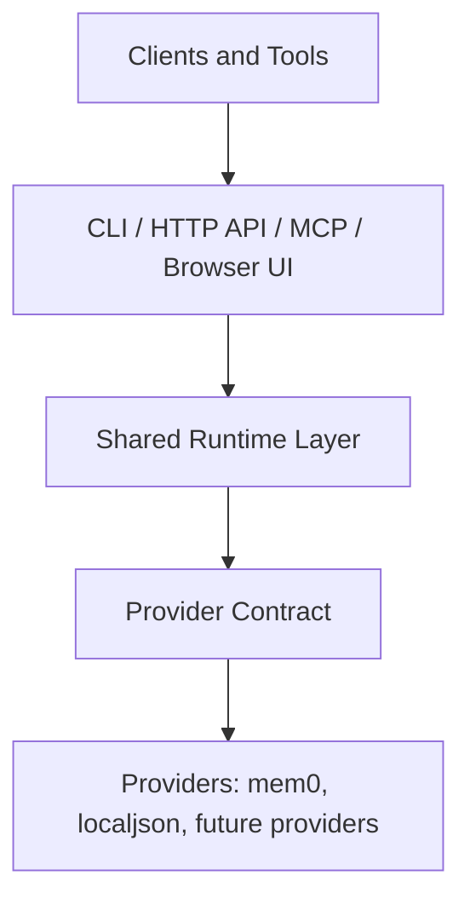

# AgentMemory

AgentMemory is a shared local memory runtime for AI clients and agents.

It sits above a memory backend such as `mem0` and exposes one stable surface through CLI, HTTP API, and MCP.

If you only need one Python application talking directly to a memory engine, direct `mem0` integration is often enough.

If memory needs to behave like shared local infrastructure for multiple tools, scripts, and agent clients, that is where AgentMemory adds value.

## Why This Project Exists

Most memory systems solve the backend problem: storing, retrieving, and ranking memories.

AgentMemory solves a different problem: making one memory backend usable as one local runtime across multiple client surfaces.

That includes:

- CLI workflows
- local HTTP API access
- MCP tool access
- browser-based inspection
- diagnostics and runtime guidance
- provider-aware transport behavior
- optional lifecycle semantics such as TTL expiry when the caller chooses to use them

This is the main distinction:

- `mem0` is a memory engine
- `AgentMemory` is a memory runtime layer
- `AgentMemory` is not the layer that decides what should be remembered temporarily or permanently

Start here if you want the fuller explanation:

- [Why AgentMemory Exists](docs/WHY_AGENTMEMORY.md)
- [Mem0 vs AgentMemory](docs/MEM0_VS_AGENTMEMORY.md)
- [What AgentMemory Adds To Mem0](docs/MEM0_WITH_AGENTMEMORY_VALUE.md)
- [What AgentMemory Actually Adds](docs/WHAT_AGENTMEMORY_ACTUALLY_ADDS.md)
- [Start Here](docs/START_HERE.md)

## When You Probably Do Not Need AgentMemory

You probably do not need AgentMemory if:

- one Python application owns memory directly
- direct provider integration is already clean
- you do not need MCP or HTTP access
- you do not need several tools to share one runtime

In that case, direct `mem0` integration is usually simpler.

## When AgentMemory Is Useful

AgentMemory becomes useful when one memory backend must serve many surfaces consistently.

Strong current examples:

- one backend reused by CLI, MCP, scripts, and browser tooling
- one owner process for a backend with local runtime constraints
- one stable contract above backend-specific quirks

More concrete scenarios:

- [Use Cases](docs/USE_CASES.md)
- [Shared Runtime Demo](examples/shared-runtime-demo.md)
- [MCP Demo](examples/mcp-demo.md)

## Quickstart

### Fastest Safe Evaluation Path

Use the built-in `localjson` provider first.

```powershell
git clone <your-repo-url>
cd AgentMemory
py -3.13 -m venv .venv
.\.venv\Scripts\python.exe -m pip install --upgrade pip
.\.venv\Scripts\python.exe -m pip install -e .
.\.venv\Scripts\agentmemory.exe configure --provider localjson
.\.venv\Scripts\agentmemory.exe doctor
.\.venv\Scripts\agentmemory.exe start-api
.\.venv\Scripts\python.exe .\examples\http_python_roundtrip.py
.\.venv\Scripts\python.exe -m agentmemory.ops_cli list --user-id examples-http-roundtrip --limit 5
```

This path proves:

- package install works
- the local runtime starts
- the HTTP API works
- one client surface can read and write memory immediately

What success looks like:

- `doctor` reports no blocking errors
- `start-api` prints the local API URL
- `http_python_roundtrip.py` prints a created memory plus list and search results
- the final `list` command shows at least one memory for `examples-http-roundtrip`

When you are done:

```powershell
.\.venv\Scripts\agentmemory.exe stop-api
```

### Local Runtime Files

AgentMemory generates local runtime state during setup and use.

These files are local-only and should not be committed:

- `.env`
- `agentmemory.config.json`
- `data/`

The repository only ships safe templates such as `.env.example`.

### Main Semantic Backend

Only switch to `mem0` after the `localjson` path above succeeds.

If you want the main semantic path, switch to `mem0`:

```powershell
.\.venv\Scripts\agentmemory.exe configure --provider mem0 --openrouter-api-key "your-openrouter-key"
.\.venv\Scripts\agentmemory.exe doctor
.\.venv\Scripts\agentmemory.exe start-api
```

What success looks like:

- `doctor` confirms the configured runtime is usable
- `start-api` starts cleanly with the configured provider
- you can rerun `.\.venv\Scripts\python.exe .\examples\http_python_roundtrip.py`

### macOS / Linux

```sh
git clone <your-repo-url>
cd AgentMemory
python3 -m venv .venv
./.venv/bin/python -m pip install --upgrade pip
./.venv/bin/python -m pip install -e .
./.venv/bin/agentmemory configure --provider localjson
./.venv/bin/agentmemory doctor
./.venv/bin/agentmemory start-api
./.venv/bin/python ./examples/http_python_roundtrip.py
./.venv/bin/python -m agentmemory.ops_cli list --user-id examples-http-roundtrip --limit 5
```

What success looks like:

- `doctor` reports no blocking errors
- `start-api` prints the local API URL
- the roundtrip script prints a created memory plus list and search results
- the final `list` command shows at least one memory for `examples-http-roundtrip`

When you are done:

```sh
./.venv/bin/agentmemory stop-api
```

### Shared Runtime Demo

The canonical onboarding story is:

- write memory through the local HTTP API
- read the same memory back through the CLI
- confirm one shared runtime is serving both client surfaces

See:

- [Shared Runtime Demo](examples/shared-runtime-demo.md)

### Quick Troubleshooting

If the quickstart does not work immediately, check these first:

- If `agentmemory` is not found, use the explicit `.venv` command paths shown above instead of relying on shell activation.
- If the API fails to start, rerun `.\.venv\Scripts\agentmemory.exe doctor` and read the blocking errors first.
- If the API port is already busy, `start-api` should choose a free port; rerun the roundtrip script only after the printed API URL appears.
- If the `mem0` path fails, go back to `localjson` first. The first evaluation path should not depend on external API keys or semantic-provider setup.

## Architecture Snapshot



Current runtime layers:

- provider contract: normalized records, typed provider errors, capabilities, runtime policy
- shared runtime: operation registry, adapters, validation, error shaping, proxy/direct routing
- surfaces: CLI, HTTP API, MCP, interactive shell, browser UI
- optional runtime semantics: pagination, portability, scope inventory, and user-controlled lifecycle support

More detail:

- [Architecture](docs/ARCHITECTURE.md)
- [Provider Adapter Rules](docs/PROVIDER_ADAPTER_RULES.md)
- [Future Memory Providers](docs/future-memory-providers/README.md)

## Current Status

- `public alpha`
- local-first product
- runtime core works on Windows, Linux, and expected macOS paths
- Windows-first client integration workflow
- `mem0` is the main semantic provider
- `localjson` is the built-in testing and demo provider
- provider contract, operation registry, transport adapters, and runtime policy are implemented
- diagnostics and scope discovery are part of the current product surface

## Current Limitations

AgentMemory is usable as a local shared-memory runtime, but it is still a
public alpha. The current risk/bug index lives in
[Backlog — Known Bugs & Hygiene Items](docs/BACKLOG.md).

Important current limitations:

- TTL exists as optional expiry support. It is caller-controlled metadata, not
  automatic short-term/long-term classification. Providers with degraded scope
  registry sync may require `rebuild-scope-registry` before TTL sweeps can be
  considered complete.
- `mem0` uses the safe single-page fallback for pagination until a backend-safe
  cursor strategy is implemented.
- Compose v2 external-network drift is mitigated by `deploy/redeploy.sh`, but
  the upstream root cause remains outside this repo.

## Key Design Choice For Mem0

`mem0` uses local embedded storage in this project, and local embedded backends can have process and lock constraints.

AgentMemory handles that by giving the provider an explicit runtime transport policy:

- the local API process can own the backend runtime
- other clients can proxy through that runtime
- shared layers do not need backend-specific branching for transport behavior

This is one of the clearest examples of why a memory runtime layer can be useful even when the backend is still `mem0`.

## Main Commands

```powershell
.\.venv\Scripts\agentmemory.exe --help
.\.venv\Scripts\agentmemory.exe doctor
.\.venv\Scripts\agentmemory.exe configure --provider localjson
.\.venv\Scripts\agentmemory.exe configure --provider mem0 --openrouter-api-key "your-openrouter-key"
.\.venv\Scripts\agentmemory.exe start-api
.\.venv\Scripts\agentmemory.exe stop-api
.\.venv\Scripts\agentmemory.exe mcp-smoke
.\.venv\Scripts\agentmemory.exe connect-clients
.\.venv\Scripts\agentmemory.exe status-clients --compact
.\.venv\Scripts\agentmemory.exe doctor-clients --compact
```

## Root Entry Points

For users who want one obvious launcher from the repository root, AgentMemory now also ships thin root wrappers for both Windows and POSIX shells.

Windows:

```powershell
.\agentmemory.ps1 doctor
.\start-agentmemory-api.ps1
.\stop-agentmemory-api.ps1
.\agentmemory-mcp.ps1
```

macOS / Linux:

```sh
./agentmemory.sh doctor
./start-agentmemory-api.sh
./stop-agentmemory-api.sh
./agentmemory-mcp.sh
```

These wrappers delegate to the maintained scripts in `scripts/`, so the root stays user-friendly without moving the operational implementation out of `scripts/`.

## Browser UI

The local API also serves a browser UI at:

```text
http://127.0.0.1:8765/
```

Current browser UI capabilities:

- runtime overview
- memory explorer
- memory detail view
- edit memory text and metadata
- pin important memories
- delete low-value memories
- client status summary

## Providers

### Mem0

Use `mem0` when you want:

- semantic retrieval
- OpenRouter-backed extraction and embeddings
- the main production path of this repo

Notes:

- requires `OPENROUTER_API_KEY`
- uses owner-process proxy transport in this repo
- is the current default provider

### Local JSON

Use `localjson` when you want:

- zero external API dependency
- a simple built-in backend for tests and demos
- an inspectable on-disk provider

## Documentation Map

- [Start Here](docs/START_HERE.md)
- [Why AgentMemory Exists](docs/WHY_AGENTMEMORY.md)
- [Mem0 vs AgentMemory](docs/MEM0_VS_AGENTMEMORY.md)
- [What AgentMemory Adds To Mem0](docs/MEM0_WITH_AGENTMEMORY_VALUE.md)
- [What AgentMemory Actually Adds](docs/WHAT_AGENTMEMORY_ACTUALLY_ADDS.md)
- [Use Cases](docs/USE_CASES.md)
- [Architecture](docs/ARCHITECTURE.md)
- [Runtime Boundaries](docs/RUNTIME_BOUNDARIES.md)
- [Backlog / Current Limitations](docs/BACKLOG.md)
- [Positioning Assets](docs/POSITIONING.md)
- [Roadmap](ROADMAP.md)
- [Contributing](CONTRIBUTING.md)
- [Security](SECURITY.md)
- [Support](SUPPORT.md)

## Examples

- [HTTP Python Roundtrip](examples/http_python_roundtrip.py)
- [Shared Runtime Demo](examples/shared-runtime-demo.md)
- [MCP Demo](examples/mcp-demo.md)

## Validation

Useful local checks:

```powershell
.\.venv\Scripts\python.exe -m unittest discover -s tests -v
.\.venv\Scripts\python.exe -m compileall agentmemory tests scripts/mcp-smoke-test.py
.\.venv\Scripts\agentmemory.exe mcp-smoke
.\.venv\Scripts\python.exe -m agentmemory.ops_cli list-scopes --limit 20
```

## Provider Certification

AgentMemory treats providers as adapter layers behind one shared contract.

Useful references:

- [PROVIDER_CERTIFICATION.md](docs/PROVIDER_CERTIFICATION.md)
- [tests/provider_contract_harness.py](tests/provider_contract_harness.py)

Quick helper commands:

```powershell
.\.venv\Scripts\provider-certify.exe --list
.\.venv\Scripts\provider-certify.exe --list --json
.\.venv\Scripts\provider-certify.exe localjson
.\.venv\Scripts\provider-certify.exe localjson --json --run-tests --summary-only
```
