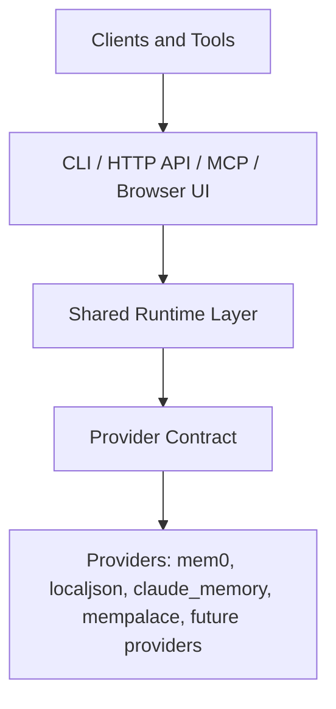

<p align="center"></p>
<h1 align="center">AgentMemory</h1>
<p align="center"><b>One shared local memory runtime for your AI tools and scripts — CLI, HTTP API and MCP on top of a swappable memory backend such as mem0.</b></p>
<p align="center">
  <a href="LICENSE"></a>
  <a href="pyproject.toml"></a>
  <a href="#current-status"></a>
  <a href="pyproject.toml"></a>
  <a href="#current-status"></a>
  <a href="https://github.com/AndrewMoryakov/AgentMemory/actions/workflows/ci.yml"></a>
</p>
<p align="center"><b>English</b> | <a href="README.ru.md">Русский</a></p>

```powershell
agentmemory configure --provider localjson   # no API keys needed
agentmemory start-api                        # one local runtime, several client surfaces
```

AgentMemory is a shared local memory runtime for AI clients and agents. It sits above a memory backend such as `mem0` and exposes one stable surface through CLI, HTTP API, and MCP — so what one tool saves, another can recall. It is currently a **public alpha**; see [Current Status](#current-status) and [Current Limitations](#current-limitations) before you depend on it.

## Why AgentMemory?

Most memory systems solve the backend problem: storing, retrieving, and ranking memories. AgentMemory solves a different one: making one memory backend usable as one local runtime across multiple client surfaces.

- **If** several AI tools, scripts, and agent clients should share one memory, **then** AgentMemory gives them the same operations through CLI, local HTTP API, and MCP.
- **If** your memory backend has local process or lock constraints, **then** one owner process can own the backend and everything else proxies through it.
- **If** you want a stable contract above backend-specific quirks, **then** providers sit behind one provider contract with normalized records and typed errors.
- **If** you also want to look at what was remembered, **then** the local API serves a browser UI for inspection and editing, and `doctor` commands explain what is wrong.

The distinction in one line: `mem0` is a memory engine; `AgentMemory` is a memory runtime layer — and it is *not* the layer that decides what should be remembered temporarily or permanently.

**Who it is not for.** You probably do not need AgentMemory if one Python application owns memory directly, direct provider integration is already clean, you do not need MCP or HTTP access, and you do not need several tools to share one runtime. In that case, direct `mem0` integration is usually simpler.

Fuller explanations:

- [Why AgentMemory Exists](docs/WHY_AGENTMEMORY.md)
- [Mem0 vs AgentMemory](docs/MEM0_VS_AGENTMEMORY.md)
- [What AgentMemory Adds To Mem0](docs/MEM0_WITH_AGENTMEMORY_VALUE.md)
- [What AgentMemory Actually Adds](docs/WHAT_AGENTMEMORY_ACTUALLY_ADDS.md)
- [Start Here](docs/START_HERE.md)

More concrete scenarios: [Use Cases](docs/USE_CASES.md), [Shared Runtime Demo](examples/shared-runtime-demo.md), [MCP Demo](examples/mcp-demo.md).

## Features

- **One runtime, three surfaces** — CLI, local HTTP API, and MCP all go through the same shared operations.
- **Swappable providers** — `mem0` (main semantic path), `localjson` (built-in test/demo provider), `claude_memory` (conservative file-backed adapter for Claude Code memory surfaces), and `mempalace` (experimental local semantic provider).
- **Client wiring** — `connect-clients` auto-connects AgentMemory to detected AI clients and editors; `status-clients` and `doctor-clients` check the result. Windows-first.
- **Browser UI** — runtime overview, memory explorer, edit, pin and delete, client status.
- **Remote MCP connectors** — MCP over HTTP at `POST /mcp` with OAuth 2.1 and Dynamic Client Registration, for hosted clients such as Claude.ai and ChatGPT custom connectors.
- **Diagnostics built in** — `doctor` checks venv, config, key availability and health; capability-aware guidance is part of the product surface.
- **Optional lifecycle semantics** — TTL expiry when the caller chooses to use it.
- **Provider certification** — providers are checked against one shared contract (`provider-certify`).

## How it works

<p align="center">
  
</p>

1. **Pick a provider.** `agentmemory configure --provider localjson` (or `mem0`) selects the memory backend behind the runtime.
2. **Run one local runtime.** `agentmemory start-api` starts the shared runtime; it can own the backend process, so other clients proxy through it instead of fighting over local locks.
3. **Connect your clients.** CLI, scripts over HTTP, and MCP clients (via `connect-clients` or the [snippets](#main-commands)) all talk to that one runtime.
4. **Use the same operations everywhere.** Clients talk to the shared contract, not to backend-specific APIs, so one tool's writes are visible to the others.

<a id="quickstart"></a>
## Quick start

### Fastest Safe Evaluation Path

Use the built-in `localjson` provider first.

```powershell
git clone https://github.com/AndrewMoryakov/AgentMemory.git
cd AgentMemory
py -3.13 -m venv .venv
.\.venv\Scripts\python.exe -m pip install --upgrade pip
.\.venv\Scripts\python.exe -m pip install -e .
.\.venv\Scripts\agentmemory.exe configure --provider localjson
.\.venv\Scripts\agentmemory.exe doctor
.\.venv\Scripts\agentmemory.exe start-api
.\.venv\Scripts\python.exe .\examples\http_python_roundtrip.py
.\.venv\Scripts\python.exe -m agentmemory.ops_cli list --user-id examples-http-roundtrip --limit 5
```

This path proves:

- package install works
- the local runtime starts
- the HTTP API works
- one client surface can read and write memory immediately

What success looks like:

- `doctor` reports no blocking errors
- `start-api` prints the local API URL
- `http_python_roundtrip.py` prints a created memory plus list and search results
- the final `list` command shows at least one memory for `examples-http-roundtrip`

When you are done:

```powershell
.\.venv\Scripts\agentmemory.exe stop-api
```

### macOS / Linux

```sh
git clone https://github.com/AndrewMoryakov/AgentMemory.git
cd AgentMemory
python3 -m venv .venv
./.venv/bin/python -m pip install --upgrade pip
./.venv/bin/python -m pip install -e .
./.venv/bin/agentmemory configure --provider localjson
./.venv/bin/agentmemory doctor
./.venv/bin/agentmemory start-api
./.venv/bin/python ./examples/http_python_roundtrip.py
./.venv/bin/python -m agentmemory.ops_cli list --user-id examples-http-roundtrip --limit 5
```

What success looks like:

- `doctor` reports no blocking errors
- `start-api` prints the local API URL
- the roundtrip script prints a created memory plus list and search results
- the final `list` command shows at least one memory for `examples-http-roundtrip`

When you are done:

```sh
./.venv/bin/agentmemory stop-api
```

### Main Semantic Backend

Only switch to `mem0` after the `localjson` path above succeeds. If you want the main semantic path, switch to `mem0`:

```powershell
.\.venv\Scripts\agentmemory.exe configure --provider mem0 --openrouter-api-key "your-openrouter-key"
.\.venv\Scripts\agentmemory.exe doctor
.\.venv\Scripts\agentmemory.exe start-api
```

What success looks like:

- `doctor` confirms the configured runtime is usable
- `start-api` starts cleanly with the configured provider
- you can rerun `.\.venv\Scripts\python.exe .\examples\http_python_roundtrip.py`

### Shared Runtime Demo

The canonical onboarding story is:

- write memory through the local HTTP API
- read the same memory back through the CLI
- confirm one shared runtime is serving both client surfaces

See [Shared Runtime Demo](examples/shared-runtime-demo.md).

### Local Runtime Files

AgentMemory generates local runtime state during setup and use. These files are local-only and should not be committed:

- `.env`
- `agentmemory.config.json`
- `data/`

The repository only ships safe templates such as `.env.example`.

### Quick Troubleshooting

If the quickstart does not work immediately, check these first:

- If `agentmemory` is not found, use the explicit `.venv` command paths shown above instead of relying on shell activation.
- If the API fails to start, rerun `.\.venv\Scripts\agentmemory.exe doctor` and read the blocking errors first.
- If the API port is already busy, `start-api` should choose a free port; rerun the roundtrip script only after the printed API URL appears.
- If the `mem0` path fails, go back to `localjson` first. The first evaluation path should not depend on external API keys or semantic-provider setup.

## Architecture Snapshot


```mermaid
flowchart TD
    A["Clients and Tools"] --> B["CLI / HTTP API / MCP / Browser UI"]
    B --> C["Shared Runtime Layer"]
    C --> D["Provider Contract"]
    D --> E["Providers: mem0, localjson, claude_memory, mempalace, future providers"]
```

Current runtime layers:

- provider contract: normalized records, typed provider errors, capabilities, runtime policy
- shared runtime: operation registry, adapters, validation, error shaping, proxy/direct routing
- surfaces: CLI, HTTP API, MCP, interactive shell, browser UI
- optional runtime semantics: pagination, portability, scope inventory, and user-controlled lifecycle support

More detail:

- [Architecture](docs/ARCHITECTURE.md)
- [Provider Adapter Rules](docs/PROVIDER_ADAPTER_RULES.md)
- [Future Memory Providers](docs/future-memory-providers/README.md)

## Current Status

- `public alpha`
- local-first product
- runtime core works on Windows, Linux, and expected macOS paths
- Windows-first client integration workflow
- `mem0` is the main semantic provider
- `localjson` is the built-in testing and demo provider
- `claude_memory` is the conservative file-backed adapter for Claude Code memory surfaces
- `mempalace` is the experimental local semantic provider backed by an AgentMemory-owned MemPalace collection
- provider contract, operation registry, transport adapters, and runtime policy are implemented
- diagnostics and scope discovery are part of the current product surface

## Current Limitations

AgentMemory is usable as a local shared-memory runtime, but it is still a public alpha. The current risk/bug index lives in [Backlog — Known Bugs & Hygiene Items](docs/planning/BACKLOG.md).

Important current limitations:

- TTL exists as optional expiry support. It is caller-controlled metadata, not automatic short-term/long-term classification. Providers with degraded scope registry sync may require `rebuild-scope-registry` before TTL sweeps can be considered complete.
- `mem0` uses the safe single-page fallback for pagination until a backend-safe cursor strategy is implemented.
- Compose v2 external-network drift is mitigated by `deploy/redeploy.sh`, but the upstream root cause remains outside this repo.

## Key Design Choice For Mem0

`mem0` uses local embedded storage in this project, and local embedded backends can have process and lock constraints.

AgentMemory handles that by giving the provider an explicit runtime transport policy:

- the local API process can own the backend runtime
- other clients can proxy through that runtime
- shared layers do not need backend-specific branching for transport behavior

This is one of the clearest examples of why a memory runtime layer can be useful even when the backend is still `mem0`.

## Main Commands

```powershell
.\.venv\Scripts\agentmemory.exe --help
.\.venv\Scripts\agentmemory.exe doctor
.\.venv\Scripts\agentmemory.exe configure --provider localjson
.\.venv\Scripts\agentmemory.exe configure --provider mem0 --openrouter-api-key "your-openrouter-key"
.\.venv\Scripts\agentmemory.exe start-api
.\.venv\Scripts\agentmemory.exe stop-api
.\.venv\Scripts\agentmemory.exe mcp-smoke
.\.venv\Scripts\agentmemory.exe connect-clients
.\.venv\Scripts\agentmemory.exe status-clients --compact
.\.venv\Scripts\agentmemory.exe doctor-clients --compact
```

`agentmemory snippets` prints ready-to-use Claude Code and Gemini CLI snippets.

## Root Entry Points

For users who want one obvious launcher from the repository root, AgentMemory also ships thin root wrappers for both Windows and POSIX shells.

Windows:

```powershell
.\agentmemory.ps1 doctor
.\start-agentmemory-api.ps1
.\stop-agentmemory-api.ps1
.\agentmemory-mcp.ps1
```

macOS / Linux:

```sh
./agentmemory.sh doctor
./start-agentmemory-api.sh
./stop-agentmemory-api.sh
./agentmemory-mcp.sh
```

These wrappers delegate to the maintained scripts in `scripts/`, so the root stays user-friendly without moving the operational implementation out of `scripts/`.

## Remote MCP Connectors (Claude.ai, ChatGPT)

When AgentMemory is exposed on a public URL, it speaks MCP over HTTP at `POST /mcp` and supports OAuth 2.1 with Dynamic Client Registration (RFC 7591). Hosted MCP clients like Claude.ai Custom Connectors or ChatGPT Custom Connectors discover the server and register themselves without any operator-issued client_id.

Setup on Claude.ai:

1. Settings → Connectors → **Add custom connector**.
2. **Remote MCP server URL**: `https://your-host/mcp`.
3. Save. Claude.ai fetches `/.well-known/oauth-authorization-server`, POSTs to `/register` to mint its own client credentials, opens the authorize page, and stores the resulting access token.

No fields under "Advanced" need to be filled in. Client records persist at `{runtime_dir}/oauth_clients.json` and issued tokens at `{runtime_dir}/oauth_tokens.json` — both survive container restarts.

Server-side knobs:

- `AGENTMEMORY_API_TOKEN` — pre-shared bearer accepted alongside OAuth.
- `AGENTMEMORY_OAUTH_CLIENT_ID` / `_SECRET` — optional static client. Not required when DCR is on (the default).
- `AGENTMEMORY_OAUTH_DISABLE_DCR=1` — turn off `/register` (clients must then be pre-shared).
- `AGENTMEMORY_REGISTER_RATE_LIMIT_PER_HOUR` — per-IP cap on /register (default 20).
- `AGENTMEMORY_PUBLIC_URL` — the canonical https URL the server should advertise in OAuth discovery.

## Browser UI

The local API also serves a browser UI at:

```text
http://127.0.0.1:8765/
```

Current browser UI capabilities:

- runtime overview
- memory explorer
- memory detail view
- edit memory text and metadata
- pin important memories
- delete low-value memories
- client status summary

## Providers

### Mem0

Use `mem0` when you want:

- semantic retrieval
- OpenRouter-backed extraction and embeddings
- the main production path of this repo

Notes:

- requires `OPENROUTER_API_KEY`
- uses owner-process proxy transport in this repo
- is the current default provider

### Local JSON

Use `localjson` when you want:

- zero external API dependency
- a simple built-in backend for tests and demos
- an inspectable on-disk provider

## Documentation Map

- [Start Here](docs/START_HERE.md)
- [Why AgentMemory Exists](docs/WHY_AGENTMEMORY.md)
- [Mem0 vs AgentMemory](docs/MEM0_VS_AGENTMEMORY.md)
- [What AgentMemory Adds To Mem0](docs/MEM0_WITH_AGENTMEMORY_VALUE.md)
- [What AgentMemory Actually Adds](docs/WHAT_AGENTMEMORY_ACTUALLY_ADDS.md)
- [Use Cases](docs/USE_CASES.md)
- [Architecture](docs/ARCHITECTURE.md)
- [Runtime Boundaries](docs/RUNTIME_BOUNDARIES.md)
- [Backlog / Current Limitations](docs/planning/BACKLOG.md)
- [Positioning Assets](docs/POSITIONING.md)
- [Roadmap](docs/planning/ROADMAP.md)
- [Contributing](CONTRIBUTING.md)
- [Security](SECURITY.md)
- [Support](SUPPORT.md)

## Examples

- [HTTP Python Roundtrip](examples/http_python_roundtrip.py)
- [Shared Runtime Demo](examples/shared-runtime-demo.md)
- [MCP Demo](examples/mcp-demo.md)

## Validation

Useful local checks:

```powershell
.\.venv\Scripts\python.exe -m unittest discover -s tests -v
.\.venv\Scripts\python.exe -m compileall agentmemory tests scripts/mcp-smoke-test.py
.\.venv\Scripts\agentmemory.exe mcp-smoke
.\.venv\Scripts\python.exe -m agentmemory.ops_cli list-scopes --limit 20
```

## Provider Certification

AgentMemory treats providers as adapter layers behind one shared contract.

Useful references:

- [PROVIDER_CERTIFICATION.md](docs/PROVIDER_CERTIFICATION.md)
- [tests/provider_contract_harness.py](tests/provider_contract_harness.py)

Quick helper commands:

```powershell
.\.venv\Scripts\provider-certify.exe --list
.\.venv\Scripts\provider-certify.exe --list --json
.\.venv\Scripts\provider-certify.exe localjson
.\.venv\Scripts\provider-certify.exe localjson --json --run-tests --summary-only
```

## License

[MIT](LICENSE).
