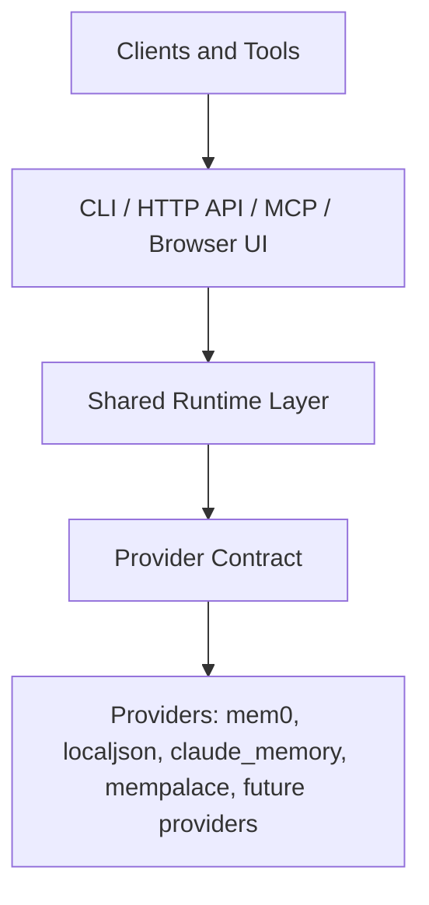

<p align="center"></p>
<h1 align="center">AgentMemory</h1>
<p align="center"><b>One shared local memory runtime for your AI tools and scripts: a stable set of memory operations over CLI, HTTP API and MCP (local or remote), swappable storage providers such as mem0, built-in diagnostics, client wiring, a web console and a provider certification harness.</b></p>
<p align="center">
  <a href="LICENSE"></a>
  <a href="pyproject.toml"></a>
  <a href="#current-status"></a>
  <a href="pyproject.toml"></a>
  <a href="#current-status"></a>
  <a href="https://github.com/AndrewMoryakov/AgentMemory/actions/workflows/ci.yml"></a>
</p>
<p align="center"><b>English</b> | <a href="README.ru.md">Русский</a></p>

```powershell
agentmemory configure --provider localjson   # no API keys needed
agentmemory start-api                        # one local runtime, several client surfaces
```

AgentMemory is a shared local memory runtime for AI clients and agents. It sits above a memory backend (a *provider*: `mem0`, a built-in JSON store, and two experimental adapters) and exposes **one stable set of 14 memory operations** through a CLI, a local HTTP API and an MCP server, so what one tool saves, another can recall. Around that core it adds: an owner-process transport for backends that cannot be opened by many processes at once; one-command wiring into ten AI clients and editors; a remote MCP endpoint with bearer-token and OAuth 2.1 (Dynamic Client Registration) support; JSONL export/import; opt-in memory semantics (dedup, TTL, stale warnings, a read-only conflict check); a `doctor` that explains what is wrong; a browser console; metrics; Docker deployment files; and a provider certification harness for adding new backends.

It is a **public alpha** (version 0.1.0, local-first, not hardened for hostile multi-tenant or open-network use). See [Current Status](#current-status) and [Current Limitations](#current-limitations) before you depend on it.

**Contents:** [In plain words](#in-plain-words) · [What's inside](#whats-inside) · [How it works](#how-it-works) · [Quick start](#quickstart) · [Concepts](#concepts) · [Surfaces](#surfaces) · [Providers](#providers) · [Client wiring](#client-wiring) · [Remote MCP](#remote-mcp-connectors-claudeai-chatgpt) · [Security](#security-and-identity) · [Memory semantics](#memory-semantics) · [Data portability](#export-import-and-hygiene) · [Web console](#browser-ui) · [Operations](#operations-and-deployment) · [Reference](#reference) · [Troubleshooting](#troubleshooting) · [Status](#current-status) · [Limitations](#current-limitations) · [Docs map](#documentation-map)

## In plain words

### The problem

Every AI tool you use keeps its own notes, or none at all. A coding agent learns your preferences, and the next tool, a script or a different agent starts from zero. Memory backends such as `mem0` solve *storing and ranking* memories, but each has its own SDK, its own record shapes and its own quirks: some use local files that only one process may open, some need API keys, some are not reachable from a hosted AI client at all. Without a shared layer, every tool re-implements the integration and behaves differently.

### Who it is for

People who run several AI clients or agents (Claude Code, Codex, Gemini CLI, Cursor and similar), plus scripts, and want them to share one memory on their own machine; people who want to expose that memory to hosted clients such as Claude.ai or ChatGPT custom connectors; and developers who want to put another memory backend behind the same contract.

### What you get

- **One memory, many clients.** The same operations (add, search, list, get, update, delete, scopes, export/import, reconcile, health) are available from the CLI, an HTTP API and MCP tools, with the same validation and the same typed errors.
- **A backend you can swap.** Providers sit behind one contract with normalized records and declared capabilities. Start with the zero-dependency `localjson` provider; switch to `mem0` for semantic retrieval.
- **A runtime that copes with fragile backends.** When a backend must be opened by one process only, one *owner* process runs it and everything else proxies through it.
- **Setup help.** `connect-clients` wires AgentMemory into detected clients (Windows-first), `doctor` and `doctor-clients` say what is wrong, named profiles separate environments.
- **Remote access when you want it.** MCP over HTTP at `/mcp`, bearer token or OAuth 2.1 with Dynamic Client Registration, rate limits and a request-size cap.
- **Ways to look and to move.** A browser console to inspect and edit memories, JSONL export/import, Prometheus-format metrics, Docker files.

### What it is not

- Not a memory *policy* engine. It does not decide what is worth remembering or how long it should live; callers do. TTL exists only as opt-in, caller-supplied metadata ([Runtime boundaries](docs/RUNTIME_BOUNDARIES.md)).
- Not a memory engine itself. The storage and retrieval quality come from the provider you choose.
- Not an authentication system for people. It has no user login; the OAuth authorize step identifies the *client*, not a person. The optional identity binding is **not tenant isolation** ([details](#security-and-identity)).
- Not hardened for hostile multi-tenant or open-network exposure ([SECURITY.md](SECURITY.md)).
- Not needed if one Python application owns its memory directly and you do not need MCP or HTTP access: direct `mem0` integration is usually simpler.

### Glossary

| Term | Meaning here |
|---|---|
| **Provider** | A memory backend adapter (`mem0`, `localjson`, `claude_memory`, `mempalace`) behind the shared contract. |
| **Provider contract** | The stable boundary: normalized `MemoryRecord` / `DeleteResult`, page shapes, declared capabilities, runtime policy and typed errors. |
| **Operation** | One of 14 shared actions (for example `add`, `search`) defined once in the operation registry and exposed by every surface. |
| **Surface** | A way to reach the operations: CLI, HTTP API, MCP server, interactive shell, browser UI. |
| **Scope** | The `user_id` / `agent_id` / `run_id` a memory belongs to. Some providers (`mem0`) require a scope for list and search. |
| **Owner process** | The single local API process that owns a backend which cannot be opened concurrently; other clients proxy through it. |
| **MCP** | Model Context Protocol, the way AI clients call tools such as `memory_search`. |
| **DCR** | OAuth Dynamic Client Registration (RFC 7591): a hosted client registers itself, so no client id has to be issued by hand. |
| **Certification** | A check that a provider honours the contract (reusable harness plus `provider-certify`). |

## What's inside

Status labels: unlabeled = implemented in this repository; **experimental** = implemented but not certified; **opt-in** = implemented, off unless you enable it; **planned** = design or roadmap only.

### One runtime, three main surfaces

- **Operation registry.** Fourteen operations are defined once and dispatched by CLI, HTTP and MCP through the same validation, typed-error shaping and identity check. → [Concepts](#concepts)
- **CLI.** `agentmemory` for install, configure, diagnostics, API control, client wiring, profiles, export/import and certification; `agentmemory.ops_cli` for data operations. Run with no arguments it opens an interactive shell with onboarding and slash commands. → [Surfaces](#surfaces)
- **HTTP API.** A local stdlib-based server with memory routes, admin routes, `/health`, `/metrics` and `/mcp`. → [HTTP API](#http-api)
- **MCP server.** A stdio server exposing the 14 `memory_*` tools, and the same tools over HTTP at `POST /mcp`; tool arguments are validated against each tool's input schema. → [MCP](#mcp)

### Providers

- **`mem0`.** The main semantic provider: semantic search with rerank, filters, update/delete, embedded storage, owner-process transport. Needs an OpenRouter key. → [Providers](#providers)
- **`localjson`.** Built-in, no API keys: text search, pagination, an inspectable JSON file. Meant for tests and demos. → [Providers](#providers)
- **`claude_memory`** (**experimental**). A conservative file-backed adapter over Claude Code memory surfaces; no update or delete. → [Providers](#providers)
- **`mempalace`** (**experimental**). A local semantic provider over an AgentMemory-owned MemPalace collection; no update. → [Providers](#providers)

### Connecting clients

- **`connect-clients`.** Detects and configures Codex, Claude Code, Claude Desktop, Gemini CLI, Qwen CLI, Cursor, VS Code / Copilot, Roo Code, KiloCode and Cline; `disconnect-clients`, `status-clients` and `doctor-clients` (json / table / compact output) complete the loop. Windows-first. → [Client wiring](#client-wiring)
- **Snippets and launchers.** `agentmemory snippets` prints Claude Code and Gemini CLI configuration; PowerShell and POSIX launchers sit at the repository root. → [Root entry points](#root-entry-points)

### Remote access and security

- **Remote MCP.** `POST /mcp` with a pre-shared bearer token and/or OAuth 2.1 (authorization code, refresh-token rotation, discovery documents, Dynamic Client Registration). → [Remote MCP](#remote-mcp-connectors-claudeai-chatgpt)
- **Guards.** Per-credential rate limit, per-IP limit on registration, request body cap, the browser UI can be switched off. → [Security](#security-and-identity)
- **Identity binding** (**opt-in**). Bind a credential to one `user_id` so it cannot name another scope. Not tenant isolation. → [Security](#security-and-identity)

### Memory semantics (all caller-controlled)

- **`infer`** (default off). Memories are stored verbatim unless the caller asks the provider's LLM to extract or rewrite them; rewrites are observable. → [Memory semantics](#memory-semantics)
- **Dedup on add** (**opt-in**), **TTL expiry** (**opt-in**, off by default), **stale-after warnings** on search results, and a read-only **conflict check** (`reconcile`). → [Memory semantics](#memory-semantics)
- **Scope inventory.** `list-scopes` reads an AgentMemory-owned registry; `rebuild-scope-registry` repairs it. → [Concepts](#concepts)

### Data, diagnostics and operations

- **Export / import.** Provider-neutral JSONL. → [Export, import and hygiene](#export-import-and-hygiene)
- **`doctor`, profiles and guidance.** Checks venv, config, keys and health; named profiles such as `default` and `staging`; provider-specific guidance. → [Profiles and doctor](#profiles-and-doctor)
- **Metrics.** In-process counters and latency, with a Prometheus text endpoint. → [Metrics](#metrics)
- **Docker and deployment files.** A Dockerfile that also builds the web console, compose files and a Traefik-fronted deployment guide. → [Operations and deployment](#operations-and-deployment)

### Web console

- **Browser UI.** Memory explorer (table and timeline), detail inspector, edit, pin, delete, add, bulk selection, scope filters, a command palette and keyboard shortcuts, a runtime status strip. Needs a one-time front-end build when you run from source. → [Browser UI](#browser-ui)

### Building and certifying providers

- **Adapter rules and contract harness.** A reusable test harness every provider subclasses; `provider-certify` and `provider-certify-ci` report and gate certification status. → [Provider certification](#provider-certification)

### Not built yet

Planned or proposed only, not in the code: a document-oriented provider backed by git and Markdown, more providers (for example Zep, Hindsight, Cognee, Graphiti), memory review and collaboration phases of the console, a soft-delete window for the TTL sweeper, a sanity guard for TTL values, a `memory_type` filter, cursor pagination for `mem0`, and an identity story for DCR-created OAuth clients. See [ROADMAP](docs/planning/ROADMAP.md), [BACKLOG](docs/planning/BACKLOG.md) and [Future Memory Providers](docs/future-memory-providers/README.md).

## Why AgentMemory?

Most memory systems solve the backend problem: storing, retrieving, and ranking memories. AgentMemory solves a different one: making one memory backend usable as one local runtime across multiple client surfaces.

- **If** several AI tools, scripts, and agent clients should share one memory, **then** AgentMemory gives them the same operations through CLI, local HTTP API, and MCP.
- **If** your memory backend has local process or lock constraints, **then** one owner process can own the backend and everything else proxies through it.
- **If** you want a stable contract above backend-specific quirks, **then** providers sit behind one provider contract with normalized records and typed errors.
- **If** you also want to look at what was remembered, **then** the local API serves a browser UI for inspection and editing, and `doctor` commands explain what is wrong.

The distinction in one line: `mem0` is a memory engine; `AgentMemory` is a memory runtime layer, and it is *not* the layer that decides what should be remembered temporarily or permanently.

**Who it is not for.** You probably do not need AgentMemory if one Python application owns memory directly, direct provider integration is already clean, you do not need MCP or HTTP access, and you do not need several tools to share one runtime. In that case, direct `mem0` integration is usually simpler.

Fuller explanations:

- [Why AgentMemory Exists](docs/WHY_AGENTMEMORY.md)
- [Mem0 vs AgentMemory](docs/MEM0_VS_AGENTMEMORY.md)
- [What AgentMemory Adds To Mem0](docs/MEM0_WITH_AGENTMEMORY_VALUE.md)
- [What AgentMemory Actually Adds](docs/WHAT_AGENTMEMORY_ACTUALLY_ADDS.md)
- [Start Here](docs/START_HERE.md)

More concrete scenarios: [Use Cases](docs/USE_CASES.md), [Shared Runtime Demo](examples/shared-runtime-demo.md), [MCP Demo](examples/mcp-demo.md).

## How it works

<p align="center">
  
</p>

1. **Pick a provider.** `agentmemory configure --provider localjson` (or `mem0`) selects the memory backend behind the runtime.
2. **Run one local runtime.** `agentmemory start-api` starts the shared runtime; it can own the backend process, so other clients proxy through it instead of fighting over local locks.
3. **Connect your clients.** CLI, scripts over HTTP, and MCP clients (via `connect-clients` or the [snippets](#main-commands)) all talk to that one runtime.
4. **Use the same operations everywhere.** Clients talk to the shared contract, not to backend-specific APIs, so one tool's writes are visible to the others.

<a id="quickstart"></a>
## Quick start

### Fastest Safe Evaluation Path

Use the built-in `localjson` provider first.

```powershell
git clone https://github.com/AndrewMoryakov/AgentMemory.git
cd AgentMemory
py -3.13 -m venv .venv
.\.venv\Scripts\python.exe -m pip install --upgrade pip
.\.venv\Scripts\python.exe -m pip install -e .
.\.venv\Scripts\agentmemory.exe configure --provider localjson
.\.venv\Scripts\agentmemory.exe doctor
.\.venv\Scripts\agentmemory.exe start-api
.\.venv\Scripts\python.exe .\examples\http_python_roundtrip.py
.\.venv\Scripts\python.exe -m agentmemory.ops_cli list --user-id examples-http-roundtrip --limit 5
```

This path proves:

- package install works
- the local runtime starts
- the HTTP API works
- one client surface can read and write memory immediately

What success looks like:

- `doctor` reports no blocking errors
- `start-api` prints the local API URL
- `http_python_roundtrip.py` prints a created memory plus list and search results
- the final `list` command shows at least one memory for `examples-http-roundtrip`

When you are done:

```powershell
.\.venv\Scripts\agentmemory.exe stop-api
```

### macOS / Linux

```sh
git clone https://github.com/AndrewMoryakov/AgentMemory.git
cd AgentMemory
python3 -m venv .venv
./.venv/bin/python -m pip install --upgrade pip
./.venv/bin/python -m pip install -e .
./.venv/bin/agentmemory configure --provider localjson
./.venv/bin/agentmemory doctor
./.venv/bin/agentmemory start-api
./.venv/bin/python ./examples/http_python_roundtrip.py
./.venv/bin/python -m agentmemory.ops_cli list --user-id examples-http-roundtrip --limit 5
```

What success looks like:

- `doctor` reports no blocking errors
- `start-api` prints the local API URL
- the roundtrip script prints a created memory plus list and search results
- the final `list` command shows at least one memory for `examples-http-roundtrip`

When you are done:

```sh
./.venv/bin/agentmemory stop-api
```

### Main Semantic Backend

Only switch to `mem0` after the `localjson` path above succeeds. If you want the main semantic path, switch to `mem0`:

```powershell
.\.venv\Scripts\agentmemory.exe configure --provider mem0 --openrouter-api-key "your-openrouter-key"
.\.venv\Scripts\agentmemory.exe doctor
.\.venv\Scripts\agentmemory.exe start-api
```

What success looks like:

- `doctor` confirms the configured runtime is usable
- `start-api` starts cleanly with the configured provider
- you can rerun `.\.venv\Scripts\python.exe .\examples\http_python_roundtrip.py`

### Next steps

- Connect your AI clients: `agentmemory connect-clients`, then `agentmemory status-clients --compact` ([Client wiring](#client-wiring)).
- Look at what was stored in the browser console ([Browser UI](#browser-ui); from source it needs a one-time `npm install && npm run build` in `web/`).
- Run the MCP self-test: `agentmemory mcp-smoke`.

### Shared Runtime Demo

The canonical onboarding story is:

- write memory through the local HTTP API
- read the same memory back through the CLI
- confirm one shared runtime is serving both client surfaces

See [Shared Runtime Demo](examples/shared-runtime-demo.md).

### Local Runtime Files

AgentMemory generates local runtime state during setup and use. These files are local-only and should not be committed:

- `.env`
- `agentmemory.config.json`
- `data/`

The repository only ships safe templates such as `.env.example`.

### Quick Troubleshooting

If the quickstart does not work immediately, check these first:

- If `agentmemory` is not found, use the explicit `.venv` command paths shown above instead of relying on shell activation.
- If the API fails to start, rerun `.\.venv\Scripts\agentmemory.exe doctor` and read the blocking errors first.
- If the API port is already busy, `start-api` should choose a free port; rerun the roundtrip script only after the printed API URL appears.
- If the `mem0` path fails, go back to `localjson` first. The first evaluation path should not depend on external API keys or semantic-provider setup.

More in [Troubleshooting](#troubleshooting).

## Architecture Snapshot


```mermaid
flowchart TD
    A["Clients and Tools"] --> B["CLI / HTTP API / MCP / Browser UI"]
    B --> C["Shared Runtime Layer"]
    C --> D["Provider Contract"]
    D --> E["Providers: mem0, localjson, claude_memory, mempalace, future providers"]
```

Current runtime layers:

- provider contract: normalized records, typed provider errors, capabilities, runtime policy
- shared runtime: operation registry, adapters, validation, error shaping, proxy/direct routing
- surfaces: CLI, HTTP API, MCP, interactive shell, browser UI
- optional runtime semantics: pagination, portability, scope inventory, and user-controlled lifecycle support

More detail:

- [Architecture](docs/ARCHITECTURE.md)
- [Provider Adapter Rules](docs/PROVIDER_ADAPTER_RULES.md)
- [Future Memory Providers](docs/future-memory-providers/README.md)

## Concepts

### Scopes and records

A memory belongs to a **scope**: a `user_id`, an `agent_id`, a `run_id`, or a combination. Providers declare whether a scope is required (`mem0` requires one for list and search; `localjson` does not). Every provider returns the same normalized `MemoryRecord` (`id`, text, `metadata` always a dict, `provider` always populated, optional provider-specific payload only under `raw`), so clients never see backend-native shapes. Unsupported options fail with typed errors (`ProviderCapabilityError`, `ProviderScopeRequiredError`, `MemoryNotFoundError`, `ProviderUnavailableError`, `ProviderValidationError`, `ProviderConfigurationError`, and `ProviderIdentityError` for the identity check) rather than leaking backend exceptions.

AgentMemory keeps its own **scope registry** (an AgentMemory-owned inventory that `list-scopes` reads). Primary provider storage stays the source of truth; a failed registry sync marks the provider degraded instead of faking a failed write, and `agentmemory rebuild-scope-registry` repairs it.

### The 14 operations

Defined once in the operation registry ([operations.py](agentmemory/runtime/operations.py)) and exposed as MCP tools with the `memory_` prefix:

| Operation | MCP tool | What it does |
|---|---|---|
| `health` | `memory_health` | Runtime and provider information |
| `add` | `memory_add` | Store a memory (verbatim by default; `infer`, `dedup`, TTL metadata are opt-in) |
| `get` / `update` / `delete` | `memory_get` / `memory_update` / `memory_delete` | Work by record id; availability depends on provider capabilities |
| `search` / `search_page` | `memory_search` / `memory_search_page` | Semantic or text search, optionally one cursor page |
| `list` / `list_page` | `memory_list` / `memory_list_page` | Browse records in a scope |
| `list_scopes` / `list_scopes_page` | `memory_list_scopes` / `memory_list_scopes_page` | Known user, agent and run scopes |
| `export` / `import` | `memory_export` / `memory_import` | Provider-neutral JSONL |
| `reconcile` | `memory_reconcile` | Read-only check for likely conflicting memories |

### Layers

The runtime is layered: clients, then surfaces (CLI, HTTP, stdio MCP, interactive shell, browser UI), then the runtime core (registry, adapters, validation, error shaping, routing, diagnostics), then the provider contract, then provider adapters, then backend storage. Backend-specific behavior terminates at the provider boundary. See [Architecture](docs/ARCHITECTURE.md) and [Runtime Boundaries](docs/RUNTIME_BOUNDARIES.md).

### Key Design Choice For Mem0

`mem0` uses local embedded storage in this project, and local embedded backends can have process and lock constraints.

AgentMemory handles that by giving the provider an explicit runtime transport policy:

- the local API process can own the backend runtime
- other clients can proxy through that runtime
- shared layers do not need backend-specific branching for transport behavior

This is one of the clearest examples of why a memory runtime layer can be useful even when the backend is still `mem0`.

In practice: `mem0` declares the `owner_process_proxy` policy. When a CLI command or the stdio MCP server needs the backend, it makes sure the local API is running (starting it under a cross-process lock if necessary) and forwards the call over HTTP, including the API token when one is configured. Providers that declare `direct` transport (`localjson`, `claude_memory`, `mempalace`) are opened in-process.

## Surfaces

### CLI

```powershell
.\.venv\Scripts\agentmemory.exe --help
```

Running `agentmemory` with no arguments opens an interactive shell with first-run onboarding and slash commands (`/help`, `/install`, `/configure`, `/provider`, `/doctor`, `/start`, `/stop`, `/ui`, `/mcp`, `/status`, `/clients`, `/snippets`, `/exit`). Subcommands are automation-friendly. The groups:

| Group | Commands |
|---|---|
| Setup | `install`, `configure`, `profile-list`, `profile-create`, `profile-use` |
| Runtime | `start-api`, `stop-api`, `doctor`, `mcp-smoke`, `snippets` |
| Clients | `connect-clients`, `disconnect-clients`, `status-clients`, `doctor-clients` |
| Data | `list-scopes`, `export-memories`, `import-memories`, `reconcile-memories`, `rebuild-scope-registry` |
| Providers | `provider-certify` |

Day-to-day memory operations (add, search, list, get, update, delete, health, pages) are in the data CLI: `python -m agentmemory.ops_cli <command>`; for example `add --message "..." --user-id u1` and `search "query" --user-id u1 --no-rerank`. `add` stores verbatim unless you pass `--infer`.

### HTTP API

Served by the local API process (default `127.0.0.1:8765`; `start-api` picks a free port if the configured one is busy). Routes in [api.py](agentmemory/api.py):

| Route | Purpose |
|---|---|
| `GET /health` | Liveness (open); full diagnostics for authorized callers |
| `GET /metrics` | Prometheus text metrics (authorized) |
| `POST /add`, `/search`, `/search/page`, `/update` | Memory operations |
| `GET /memories`, `/memories/page`, `/memories/<id>`; `DELETE /memories/<id>` | Read and delete |
| `GET/PATCH/DELETE /admin/memories...`, `POST /admin/memories/<id>/pin`, `GET /admin/stats`, `/admin/stats/operations`, `/admin/scopes`, `/admin/scopes/page`, `/admin/clients` | Operator surface used by the browser UI |
| `POST /mcp` | MCP over HTTP (JSON-RPC, single or batch) |
| `/.well-known/oauth-authorization-server`, `/.well-known/oauth-protected-resource`, `/oauth/authorize`, `/oauth/token`, `/register` | OAuth 2.1 and Dynamic Client Registration |

Without a configured token and without OAuth, the API is open (intended for local-only use). With `AGENTMEMORY_API_TOKEN` or OAuth enabled, everything except `/health`, the discovery documents and the OAuth authorize/token/register endpoints requires a bearer credential. Error responses use typed `error_type` values mapped to HTTP statuses.

### MCP

`agentmemory-mcp` (via `scripts/run-agentmemory-mcp.ps1` or `.sh`) runs a stdio MCP server that supports protocol versions `2025-06-18` and `2024-11-05`, lists the 14 tools, and validates each call's arguments against the tool's input schema. `agentmemory mcp-smoke` runs an initialize / tools-list / tools-call self-test. The same tool set is served over HTTP at `POST /mcp` for remote clients.

### Main Commands

```powershell
.\.venv\Scripts\agentmemory.exe --help
.\.venv\Scripts\agentmemory.exe doctor
.\.venv\Scripts\agentmemory.exe configure --provider localjson
.\.venv\Scripts\agentmemory.exe configure --provider mem0 --openrouter-api-key "your-openrouter-key"
.\.venv\Scripts\agentmemory.exe start-api
.\.venv\Scripts\agentmemory.exe stop-api
.\.venv\Scripts\agentmemory.exe mcp-smoke
.\.venv\Scripts\agentmemory.exe connect-clients
.\.venv\Scripts\agentmemory.exe status-clients --compact
.\.venv\Scripts\agentmemory.exe doctor-clients --compact
```

`agentmemory snippets` prints ready-to-use Claude Code and Gemini CLI snippets.

### Root Entry Points

For users who want one obvious launcher from the repository root, AgentMemory also ships thin root wrappers for both Windows and POSIX shells.

Windows:

```powershell
.\agentmemory.ps1 doctor
.\start-agentmemory-api.ps1
.\stop-agentmemory-api.ps1
.\agentmemory-mcp.ps1
```

macOS / Linux:

```sh
./agentmemory.sh doctor
./start-agentmemory-api.sh
./stop-agentmemory-api.sh
./agentmemory-mcp.sh
```

These wrappers delegate to the maintained scripts in `scripts/`, so the root stays user-friendly without moving the operational implementation out of `scripts/`.

## Providers

| Provider | Status | Semantic search | Text search | Update | Delete | Pagination | Scope needed for list/search | Transport |
|---|---|---|---|---|---|---|---|---|
| `mem0` | certified (policy: certified with skips) | yes (rerank supported) | no | yes | yes | single-page fallback | yes | owner-process proxy |
| `localjson` | certified | no | yes | yes | yes | yes | no | direct |
| `claude_memory` | experimental | no | yes | no | no | no | no | direct |
| `mempalace` | experimental | yes | no | no | yes | no | no | direct |

The table reflects each provider's declared `capabilities()` and registry metadata in the code. Certification means a provider passes the shared contract harness; it is not a claim about retrieval quality.

### Mem0

Use `mem0` when you want:

- semantic retrieval
- OpenRouter-backed extraction and embeddings
- the main production path of this repo

Notes:

- requires `OPENROUTER_API_KEY`
- uses owner-process proxy transport in this repo
- is the current default provider (the quick start above deliberately starts with `localjson` instead)
- keeps its data in an embedded store under the runtime data directory; the default model settings use OpenRouter-hosted models (configurable with `configure` flags such as `--embedding-model`)
- the package pins `mem0ai==1.0.10`

### Local JSON

Use `localjson` when you want:

- zero external API dependency
- a simple built-in backend for tests and demos
- an inspectable on-disk provider (a single JSON file, `data/localjson-memories.json` by default, overridable with `--storage-path`)

### Claude Memory (experimental)

`claude_memory` is a conservative file-backed adapter over Claude Code memory surfaces: it can read user-level memory, project memory and auto-memory (each switchable with `--no-user-memory` / `--no-auto-memory`), and writes only into an AgentMemory-owned directory (by default `.claude/rules/agentmemory` under the project's Git root). It declares no update, no delete and no scope inventory.

### MemPalace (experimental)

`mempalace` is a local semantic provider backed by an AgentMemory-owned MemPalace collection (`--palace-path`, `--palace-id`, `--collection-name`). Its install requirement (`mempalace==3.3.5`) is installed with the provider; it declares no update and no filters.

Details and adapter rules: [Provider Adapter Rules](docs/PROVIDER_ADAPTER_RULES.md), [Future Memory Providers](docs/future-memory-providers/README.md).

## Client wiring

`agentmemory connect-clients` detects supported clients and adds AgentMemory as an MCP server: Codex, Claude Code, Claude Desktop, Gemini CLI, Qwen CLI, Cursor, VS Code / Copilot, Roo Code, KiloCode and Cline. Where a client's configuration is a file, the previous file is backed up under `data/backups/client-configs`. `disconnect-clients` removes it again; `status-clients` and `doctor-clients` report detection, configuration state and local MCP health in `--json`, `--table` or `--compact` form (stable exit codes for scripting). The workflow is Windows-first; the runtime itself also runs on Linux and macOS, but client auto-connect on those platforms is less exercised. For clients not on the list, use `agentmemory snippets` or point any MCP client at `scripts/run-agentmemory-mcp.ps1` / `.sh`.

## Remote MCP Connectors (Claude.ai, ChatGPT)

When AgentMemory is exposed on a public URL, it speaks MCP over HTTP at `POST /mcp` and supports OAuth 2.1 with Dynamic Client Registration (RFC 7591). Hosted MCP clients like Claude.ai Custom Connectors or ChatGPT Custom Connectors discover the server and register themselves without any operator-issued client_id.

Setup on Claude.ai:

1. Settings → Connectors → **Add custom connector**.
2. **Remote MCP server URL**: `https://your-host/mcp`.
3. Save. Claude.ai fetches `/.well-known/oauth-authorization-server`, POSTs to `/register` to mint its own client credentials, opens the authorize page, and stores the resulting access token.

No fields under "Advanced" need to be filled in. Client records persist at `{runtime_dir}/oauth_clients.json` and issued tokens at `{runtime_dir}/oauth_tokens.json` — both survive container restarts.

Server-side knobs:

- `AGENTMEMORY_API_TOKEN` — pre-shared bearer accepted alongside OAuth.
- `AGENTMEMORY_OAUTH_CLIENT_ID` / `_SECRET` — optional static client. Not required when DCR is on (the default).
- `AGENTMEMORY_OAUTH_DISABLE_DCR=1` — turn off `/register` (clients must then be pre-shared).
- `AGENTMEMORY_REGISTER_RATE_LIMIT_PER_HOUR` — per-IP cap on /register (default 20).
- `AGENTMEMORY_PUBLIC_URL` — the canonical https URL the server should advertise in OAuth discovery.

Access tokens last 7 days and refresh tokens 30 days; a refresh rotates the pair and invalidates the old refresh token. Registered clients are stored with hashed secrets. Read [Security and identity](#security-and-identity) before exposing the server: the authorize step auto-approves and there is no end-user login.

## Security and identity

- **Local by default.** The API binds `127.0.0.1`; with no token and no OAuth it accepts anonymous local calls. Set `AGENTMEMORY_API_TOKEN` (the root `docker-compose.yml` refuses to start without one) before binding to anything other than loopback.
- **Guards.** A per-credential token-bucket rate limit (default 60 per minute, `AGENTMEMORY_RATE_LIMIT_PER_MINUTE`), a per-IP cap on `/register`, a request body cap (default 16 MiB, `AGENTMEMORY_MAX_BODY_BYTES`), and `AGENTMEMORY_DISABLE_UI=1` to turn the browser UI off on remote deployments.
- **No end-user authentication.** AgentMemory has no login. By default `user_id` is taken from the request payload, so any valid credential can name any scope.
- **Opt-in identity binding.** With `AGENTMEMORY_ENFORCE_AUTH_USER_ID=1` and a credential that carries a bound identity (configured per OAuth client, for example `AGENTMEMORY_OAUTH_BOUND_USER_ID`), a matching `user_id` passes, a missing one is filled in, and a different one is refused with `ProviderIdentityError` (HTTP 403). Operations that range over the whole store and the `/admin/*` routes are refused to a bound credential. The check lives in the single wrapper every operation passes through, so HTTP, MCP and CLI share it.
- **What binding does not give you.** It is not tenant isolation: it is only as trustworthy as whatever issued the token; it is void while dynamic registration is enabled and unbound credentials exist; it must be set on the process clients talk to; `agent_id` and `run_id` are not bound; providers do not partition storage. Read [Auth identity binding](docs/AUTH_IDENTITY_BINDING.md) and [SECURITY.md](SECURITY.md) first.

## Memory semantics

AgentMemory executes declared semantics consistently; it does not guess intent ([Runtime Boundaries](docs/RUNTIME_BOUNDARIES.md)).

- **`infer` is off by default.** `memory_add` stores the text verbatim. With `infer=true` the provider's LLM may extract, rewrite or split the input (one LLM call per write); the response then says so (`transformed`, `original_text`, `stored_text`) and extra records appear under `additional_records`. The CLI mirrors this: `--infer` is explicit opt-in.
- **Dedup on add (opt-in).** `dedup=true` runs a semantic search in the same scope first and returns the matching existing record (`dedup_hit`) instead of inserting a duplicate. Needs a scope and a provider with semantic search; the similarity threshold is not user-tunable yet.
- **TTL is opt-in and off by default.** `metadata.ttl_seconds` or `metadata.expires_at` are rejected unless the operator sets `AGENTMEMORY_ALLOW_TTL=1`. When enabled, expired records are hidden from reads and a background sweeper (default every 10 minutes, `AGENTMEMORY_TTL_SWEEP_MINUTES`) hard-deletes them; a mistyped unit can destroy a record permanently, which is why it is off. TTL is caller-controlled metadata, not automatic short-term/long-term classification.
- **Stale warnings.** If a record's `metadata.stale_after` has passed, search results carry a `stale_warning` (the record is not hidden) so callers re-verify time-bound facts.
- **Reconcile.** `reconcile-memories` / `memory_reconcile` is a read-only hygiene check that lists likely conflicting memory pairs in a scope. It does not modify storage and is an early heuristic, not a guarantee.

## Export, import and hygiene

- `agentmemory export-memories <path>` and `import-memories <path>` (also MCP `memory_export` / `memory_import`) move memories as provider-neutral JSONL by walking the scope inventory. Import replays records through `add` with `infer=false` for round-trip fidelity. The path is resolved on the machine running the operation, so over a remote MCP connection it is a server-side path. Export and import are refused to identity-bound credentials.
- `rebuild-scope-registry` re-seeds the scope inventory for the active provider.
- Writes of runtime files (state, registries, tokens) go through atomic write helpers.

## Profiles and doctor

- **Profiles.** `profile-list`, `profile-create <name> [--copy-from ...]` and `profile-use <name>` manage named runtime profiles (for example `default`, `staging`); `AGENTMEMORY_PROFILE` selects one for a process and `AGENTMEMORY_HOME` points at the runtime root.
- **`doctor`.** Checks the venv, configuration, key availability and health, and reports the active profile, runtime id, config version, API runtime state and provider contract version, with provider-specific guidance. A missing `.env` is informational so the `localjson` path stays quiet. `start-api` distinguishes a stale PID from a foreign process on the port.

## Browser UI

The local API also serves a browser UI at:

```text
http://127.0.0.1:8765/
```

Current browser UI capabilities:

- runtime overview
- memory explorer
- memory detail view
- edit memory text and metadata
- pin important memories
- delete low-value memories
- client status summary

The UI is a Vue 3 single-page app in [`web/`](web/): a table and a timeline view, an inspector, bulk selection, an add-memory dialog, scope filters, a `/me` view for one user's memories, a command palette (`Ctrl/Cmd+K` or `/`), keyboard shortcuts (press `?` in the UI) and a status strip with live operation counters.

**Build step.** The compiled bundle is not committed. When you run from a source checkout, build it once, otherwise `/` answers with a 503 explaining that the UI bundle is not built:

```sh
cd web && npm install && npm run build
```

The Docker image builds it for you. Set `AGENTMEMORY_DISABLE_UI=1` to switch the UI off.

## Operations and deployment

### Metrics

The API collects in-process counters, latency histograms and an estimate of OpenRouter token usage and cost, rendered as Prometheus text at `GET /metrics` (authorized) and as JSON at `/admin/stats/operations`. They live in memory; a restart clears the history.

### Docker and deployment

- The [Dockerfile](Dockerfile) builds the web console in a first stage and runs the API (`python -m agentmemory.api`) in a second.
- The root [docker-compose.yml](docker-compose.yml) requires `AGENTMEMORY_API_TOKEN` and publishes the port on `127.0.0.1` by default (`AGENTMEMORY_BIND_ADDR`, `AGENTMEMORY_PUBLISHED_PORT`).
- [deploy/](deploy/) and [docs/DEPLOY.md](docs/DEPLOY.md) describe a reverse-proxy (Traefik) deployment as remote MCP plus HTTP, with a redeploy script that works around a Compose v2 external-network drift (see [Current Limitations](#current-limitations)) and a backup script.

## Reference

### Environment variables

| Variable | Purpose |
|---|---|
| `OPENROUTER_API_KEY` | Key for the `mem0` provider |
| `AGENTMEMORY_API_HOST`, `AGENTMEMORY_API_PORT` | API bind address and port (default `127.0.0.1:8765`) |
| `AGENTMEMORY_API_TOKEN` | Pre-shared bearer for HTTP and `/mcp` |
| `AGENTMEMORY_PUBLIC_URL` | Public base URL advertised in OAuth discovery |
| `AGENTMEMORY_OAUTH_CLIENT_ID`, `AGENTMEMORY_OAUTH_CLIENT_SECRET`, `AGENTMEMORY_OAUTH_BOUND_USER_ID` | Static OAuth client and its bound identity |
| `AGENTMEMORY_OAUTH_DISABLE_DCR`, `AGENTMEMORY_REGISTER_RATE_LIMIT_PER_HOUR` | Dynamic registration switch and limit |
| `AGENTMEMORY_OAUTH_STORE`, `AGENTMEMORY_OAUTH_TOKEN_STORE` | Override OAuth store paths |
| `AGENTMEMORY_ENFORCE_AUTH_USER_ID` | Opt-in identity binding |
| `AGENTMEMORY_RATE_LIMIT_PER_MINUTE`, `AGENTMEMORY_MAX_BODY_BYTES` | Rate limit and body cap |
| `AGENTMEMORY_DISABLE_UI` | Disable the browser UI |
| `AGENTMEMORY_ALLOW_TTL`, `AGENTMEMORY_TTL_SWEEP_MINUTES` | Enable TTL and tune the sweeper |
| `AGENTMEMORY_PROFILE`, `AGENTMEMORY_HOME` | Select a profile and the runtime root |
| `AGENTMEMORY_BIND_ADDR`, `AGENTMEMORY_PUBLISHED_PORT` | Docker Compose publish address and port |
| `AGENTMEMORY_*_MCP_CONFIG`, `AGENTMEMORY_CLAUDE_DESKTOP_CONFIG` | Override client config file locations (for example VS Code, Roo, Kilo, Cline, Claude Desktop) |

`AGENTMEMORY_OWNER_PROCESS` is set by the runtime itself for the owner process; you do not set it by hand.

### Files on disk

Under the runtime root: `.env`, `agentmemory.config.json`, `data/` (provider data, the scope registry, API PID/state files, `oauth_clients.json`, `oauth_tokens.json`, client-config backups). All are local-only.

### Repository layout

`agentmemory/` (package: `providers/`, `runtime/`, `certification/`, CLI, API, MCP, OAuth, clients), `web/` (Vue console), `scripts/` and root launchers, `deploy/`, `docs/`, `examples/`, `snippets/`, `tests/`.

## Validation

Useful local checks:

```powershell
.\.venv\Scripts\python.exe -m unittest discover -s tests -v
.\.venv\Scripts\python.exe -m compileall agentmemory tests scripts/mcp-smoke-test.py
.\.venv\Scripts\agentmemory.exe mcp-smoke
.\.venv\Scripts\python.exe -m agentmemory.ops_cli list-scopes --limit 20
```

Continuous integration runs the unit tests on Ubuntu and Windows (Python 3.13) and a separate provider certification policy check.

## Provider Certification

AgentMemory treats providers as adapter layers behind one shared contract. A provider is certified only when it returns normalized payloads, enforces its declared capabilities, raises typed errors, and passes the reusable contract harness; otherwise it is experimental. Registry statuses are `certified`, `provisional`, `experimental` and `test-only` (a fake in-memory provider proves the harness is backend-agnostic).

Useful references:

- [PROVIDER_CERTIFICATION.md](docs/PROVIDER_CERTIFICATION.md)
- [tests/provider_contract_harness.py](tests/provider_contract_harness.py)

Quick helper commands:

```powershell
.\.venv\Scripts\provider-certify.exe --list
.\.venv\Scripts\provider-certify.exe --list --json
.\.venv\Scripts\provider-certify.exe localjson
.\.venv\Scripts\provider-certify.exe localjson --json --run-tests --summary-only
```

`provider-certify-ci --json` checks that each provider still meets its expected policy status (`localjson`: certified; `mem0`: certified with skips).

## Troubleshooting

- **`agentmemory` not found.** Use the explicit `.venv` paths shown in the quick start.
- **API will not start or the port is busy.** Run `doctor` and read the blocking errors; `start-api` selects a free port and updates the runtime config, and distinguishes a stale PID from a foreign listener.
- **`mem0` fails.** Go back to `localjson`; confirm `OPENROUTER_API_KEY` is set. Some hosts cannot reach the embedding backends; `docs/DEPLOY.md` describes the symptom and a proxy-sidecar workaround.
- **Browser UI returns 503.** Build the bundle: `cd web && npm install && npm run build`.
- **Remote client gets 401.** Send `Authorization: Bearer <token>` or complete the OAuth flow; `/health` stays open.
- **`add` with TTL is rejected.** TTL is off by default; see [Memory semantics](#memory-semantics).
- **A scope looks empty or counts are off.** Run `agentmemory rebuild-scope-registry`.

## Current Status

- `public alpha`
- local-first product
- runtime core works on Windows, Linux, and expected macOS paths
- Windows-first client integration workflow
- `mem0` is the main semantic provider
- `localjson` is the built-in testing and demo provider
- `claude_memory` is the conservative file-backed adapter for Claude Code memory surfaces
- `mempalace` is the experimental local semantic provider backed by an AgentMemory-owned MemPalace collection
- provider contract, operation registry, transport adapters, and runtime policy are implemented
- diagnostics and scope discovery are part of the current product surface

## Current Limitations

AgentMemory is usable as a local shared-memory runtime, but it is still a public alpha. The current risk/bug index lives in [Backlog — Known Bugs & Hygiene Items](docs/planning/BACKLOG.md).

Important current limitations:

- TTL exists as optional expiry support. It is caller-controlled metadata, not automatic short-term/long-term classification. Providers with degraded scope registry sync may require `rebuild-scope-registry` before TTL sweeps can be considered complete.
- `mem0` uses the safe single-page fallback for pagination until a backend-safe cursor strategy is implemented.
- Compose v2 external-network drift is mitigated by `deploy/redeploy.sh`, but the upstream root cause remains outside this repo.

Also worth knowing (from the backlog and security docs):

- `infer` is off by default; with `infer=true` content can be rewritten by the provider's LLM.
- Dynamic registration and the auto-approving authorize step mean a reachable server can mint unbound tokens; identity binding is only meaningful with DCR disabled and every client bound. It is not tenant isolation.
- The sweeper hard-deletes expired records (no recovery window yet); a soft-delete window is a backlog item.
- Metrics are in memory and reset on restart.
- Client auto-connect is Windows-first.
- Open P1 backlog items include an identity for DCR-created OAuth clients and a dead-man backup ping.

## Documentation Map

- [Start Here](docs/START_HERE.md)
- [Why AgentMemory Exists](docs/WHY_AGENTMEMORY.md)
- [Mem0 vs AgentMemory](docs/MEM0_VS_AGENTMEMORY.md)
- [What AgentMemory Adds To Mem0](docs/MEM0_WITH_AGENTMEMORY_VALUE.md)
- [What AgentMemory Actually Adds](docs/WHAT_AGENTMEMORY_ACTUALLY_ADDS.md)
- [Use Cases](docs/USE_CASES.md)
- [Architecture](docs/ARCHITECTURE.md)
- [Runtime Boundaries](docs/RUNTIME_BOUNDARIES.md)
- [Auth identity binding](docs/AUTH_IDENTITY_BINDING.md)
- [Provider Adapter Rules](docs/PROVIDER_ADAPTER_RULES.md) and [Provider Certification](docs/PROVIDER_CERTIFICATION.md)
- [Deploy](docs/DEPLOY.md)
- [Backlog / Current Limitations](docs/planning/BACKLOG.md)
- [Positioning Assets](docs/POSITIONING.md)
- [Roadmap](docs/planning/ROADMAP.md)
- [Changelog](CHANGELOG.md)
- [Contributing](CONTRIBUTING.md)
- [Security](SECURITY.md)
- [Support](SUPPORT.md)

## Examples

- [HTTP Python Roundtrip](examples/http_python_roundtrip.py)
- [Shared Runtime Demo](examples/shared-runtime-demo.md)
- [MCP Demo](examples/mcp-demo.md)

## License

[MIT](LICENSE).
