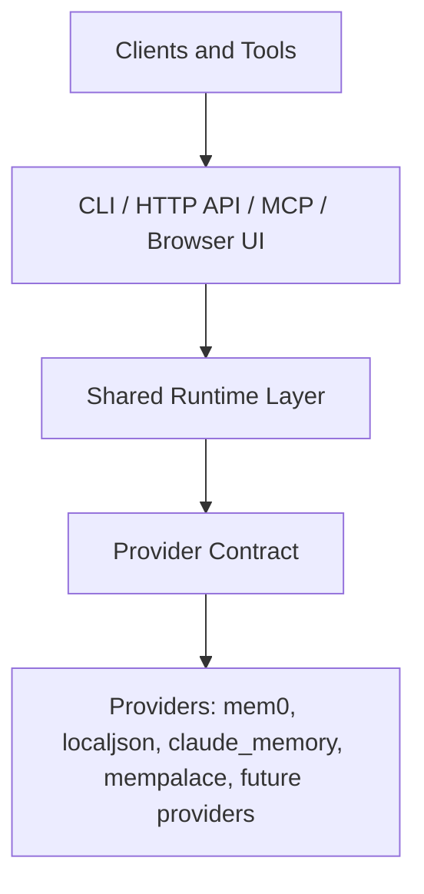

<p align="center"></p>
<h1 align="center">AgentMemory</h1>
<p align="center"><b>Одна общая локальная память для ваших ИИ-инструментов и скриптов: единый набор операций памяти через CLI, HTTP API и MCP (локально или удалённо), сменные провайдеры хранения вроде mem0, встроенная диагностика, подключение клиентов, веб-консоль и набор для сертификации провайдеров.</b></p>
<p align="center">
  <a href="LICENSE"></a>
  <a href="pyproject.toml"></a>
  <a href="#текущий-статус"></a>
  <a href="pyproject.toml"></a>
  <a href="#текущий-статус"></a>
  <a href="https://github.com/AndrewMoryakov/AgentMemory/actions/workflows/ci.yml"></a>
</p>
<p align="center"><a href="README.md">English</a> | <b>Русский</b></p>

```powershell
agentmemory configure --provider localjson   # API-ключи не нужны
agentmemory start-api                        # один локальный рантайм, несколько клиентских интерфейсов
```

AgentMemory — это общий локальный рантайм памяти для ИИ-клиентов и агентов. Он стоит над бэкендом памяти (*провайдером*: `mem0`, встроенное JSON-хранилище и два экспериментальных адаптера) и даёт **один стабильный набор из 14 операций памяти** через CLI, локальный HTTP API и MCP-сервер: то, что сохранил один инструмент, может вспомнить другой. Вокруг этого ядра он добавляет: транспорт через процесс-владелец для бэкендов, которые нельзя открывать из многих процессов сразу; подключение к десяти ИИ-клиентам и редакторам одной командой; удалённую MCP-точку с поддержкой bearer-токена и OAuth 2.1 (Dynamic Client Registration); экспорт и импорт в JSONL; опциональную семантику памяти (дедупликация, TTL, предупреждения об устаревании, проверка конфликтов только на чтение); `doctor`, объясняющий, что не так; браузерную консоль; метрики; файлы для развёртывания в Docker; и набор для сертификации провайдеров, чтобы добавлять новые бэкенды.

Это **публичная альфа** (версия 0.1.0, local-first, не рассчитана на враждебные мультиарендные сценарии и открытую сеть). Прежде чем на неё опираться, прочитайте [Текущий статус](#текущий-статус) и [Текущие ограничения](#текущие-ограничения).

**Содержание:** [В двух словах](#в-двух-словах) · [Что внутри](#что-внутри) · [Как это работает](#как-это-работает) · [Быстрый старт](#quickstart) · [Концепции](#концепции) · [Интерфейсы](#интерфейсы) · [Провайдеры](#провайдеры) · [Подключение клиентов](#подключение-клиентов) · [Удалённый MCP](#удалённые-mcp-коннекторы-claudeai-chatgpt) · [Безопасность](#безопасность-и-идентичность) · [Семантика памяти](#семантика-памяти) · [Переносимость данных](#экспорт-импорт-и-гигиена) · [Веб-консоль](#браузерный-интерфейс) · [Эксплуатация](#эксплуатация-и-развёртывание) · [Справочник](#справочник) · [Устранение неполадок](#устранение-неполадок) · [Статус](#текущий-статус) · [Ограничения](#текущие-ограничения) · [Карта документации](#карта-документации)

## В двух словах

### Проблема

У каждого ИИ-инструмента свои заметки, а то и никаких. Агент для программирования узнаёт ваши предпочтения, а следующий инструмент, скрипт или другой агент начинает с нуля. Бэкенды памяти вроде `mem0` решают задачу *хранения и ранжирования* воспоминаний, но у каждого свой SDK, свои формы записей и свои особенности: одни используют локальные файлы, которые может открыть только один процесс, другим нужны API-ключи, третьи вообще недоступны из хостируемого ИИ-клиента. Без общего слоя каждый инструмент заново пишет интеграцию и ведёт себя по-своему.

### Для кого это

Для тех, кто запускает несколько ИИ-клиентов или агентов (Claude Code, Codex, Gemini CLI, Cursor и подобные) и скрипты и хочет, чтобы они делили одну память на своей машине; для тех, кто хочет открыть эту память хостируемым клиентам вроде пользовательских коннекторов Claude.ai или ChatGPT; и для разработчиков, которые хотят подключить за тем же контрактом ещё один бэкенд памяти.

### Что вы получаете

- **Одна память для многих клиентов.** Одни и те же операции (add, search, list, get, update, delete, области, экспорт/импорт, reconcile, health) доступны из CLI, HTTP API и MCP-инструментов, с одной и той же валидацией и одними и теми же типизированными ошибками.
- **Сменный бэкенд.** Провайдеры стоят за единым контрактом с нормализованными записями и заявленными возможностями. Начните со встроенного `localjson` без зависимостей; для семантического поиска переключитесь на `mem0`.
- **Рантайм, который справляется с капризными бэкендами.** Если бэкенд должен открываться одним процессом, его запускает один процесс-*владелец*, а всё остальное ходит через него.
- **Помощь с настройкой.** `connect-clients` подключает AgentMemory к найденным клиентам (сначала Windows), `doctor` и `doctor-clients` говорят, что не так, именованные профили разделяют окружения.
- **Удалённый доступ, когда он нужен.** MCP поверх HTTP на `/mcp`, bearer-токен или OAuth 2.1 с Dynamic Client Registration, ограничения частоты и размера запроса.
- **Способы посмотреть и перенести данные.** Браузерная консоль для просмотра и правки воспоминаний, экспорт/импорт в JSONL, метрики в формате Prometheus, файлы для Docker.

### Чем это не является

- Это не движок *политики* памяти. Он не решает, что стоит запомнить и как долго это должно жить; это решает вызывающая сторона. TTL существует только как опциональные метаданные от вызывающей стороны ([Runtime boundaries](docs/RUNTIME_BOUNDARIES.md)).
- Это не сам движок памяти. Качество хранения и поиска определяет выбранный провайдер.
- Это не система аутентификации людей. Входа пользователя нет; шаг авторизации OAuth опознаёт *клиента*, а не человека. Необязательная привязка идентичности — **не изоляция арендаторов** ([подробности](#безопасность-и-идентичность)).
- Не рассчитан на враждебные мультиарендные сценарии и открытую сеть ([SECURITY.md](SECURITY.md)).
- Не нужен, если память принадлежит одному Python-приложению и вам не нужен доступ по MCP или HTTP: прямая интеграция с `mem0` обычно проще.

### Глоссарий

| Термин | Что означает здесь |
|---|---|
| **Провайдер** | Адаптер бэкенда памяти (`mem0`, `localjson`, `claude_memory`, `mempalace`) за общим контрактом. |
| **Контракт провайдера** | Стабильная граница: нормализованные `MemoryRecord` / `DeleteResult`, формы страниц, заявленные возможности, политика рантайма и типизированные ошибки. |
| **Операция** | Одно из 14 общих действий (например, `add`, `search`), описанное один раз в реестре операций и доступное во всех интерфейсах. |
| **Интерфейс (surface)** | Способ добраться до операций: CLI, HTTP API, MCP-сервер, интерактивная оболочка, браузерный интерфейс. |
| **Область (scope)** | `user_id` / `agent_id` / `run_id`, которым принадлежит воспоминание. Некоторым провайдерам (`mem0`) область нужна для list и search. |
| **Процесс-владелец** | Единственный локальный процесс API, который владеет бэкендом, не допускающим параллельного открытия; остальные клиенты ходят через него. |
| **MCP** | Model Context Protocol — способ, которым ИИ-клиенты вызывают инструменты вроде `memory_search`. |
| **DCR** | Dynamic Client Registration в OAuth (RFC 7591): хостируемый клиент регистрируется сам, client id вручную выдавать не нужно. |
| **Сертификация** | Проверка того, что провайдер соблюдает контракт (общий набор тестов плюс `provider-certify`). |

## Что внутри

Метки статуса: без метки — реализовано в этом репозитории; **экспериментально** — реализовано, но не сертифицировано; **opt-in** — реализовано, но выключено, пока вы не включите; **планируется** — только дизайн или дорожная карта.

### Один рантайм, три основных интерфейса

- **Реестр операций.** Четырнадцать операций описаны один раз и вызываются из CLI, HTTP и MCP через одну и ту же валидацию, формирование типизированных ошибок и проверку идентичности. → [Концепции](#концепции)
- **CLI.** `agentmemory` — установка, настройка, диагностика, управление API, подключение клиентов, профили, экспорт/импорт и сертификация; `agentmemory.ops_cli` — операции с данными. Без аргументов открывает интерактивную оболочку с первичной настройкой и slash-командами. → [Интерфейсы](#интерфейсы)
- **HTTP API.** Локальный сервер на стандартной библиотеке с маршрутами памяти, административными маршрутами, `/health`, `/metrics` и `/mcp`. → [HTTP API](#http-api)
- **MCP-сервер.** Stdio-сервер с 14 инструментами `memory_*` и те же инструменты поверх HTTP на `POST /mcp`; аргументы каждого вызова проверяются по входной схеме инструмента. → [MCP](#mcp)

### Провайдеры

- **`mem0`.** Основной семантический провайдер: семантический поиск с rerank, фильтры, update/delete, встроенное хранилище, транспорт через процесс-владелец. Нужен ключ OpenRouter. → [Провайдеры](#провайдеры)
- **`localjson`.** Встроенный, без API-ключей: текстовый поиск, пагинация, JSON-файл, который можно просмотреть. Для тестов и демо. → [Провайдеры](#провайдеры)
- **`claude_memory`** (**экспериментально**). Консервативный файловый адаптер для поверхностей памяти Claude Code; без update и delete. → [Провайдеры](#провайдеры)
- **`mempalace`** (**экспериментально**). Локальный семантический провайдер на базе коллекции MemPalace, принадлежащей AgentMemory; без update. → [Провайдеры](#провайдеры)

### Подключение клиентов

- **`connect-clients`.** Находит и настраивает Codex, Claude Code, Claude Desktop, Gemini CLI, Qwen CLI, Cursor, VS Code / Copilot, Roo Code, KiloCode и Cline; `disconnect-clients`, `status-clients` и `doctor-clients` (вывод json / table / compact) замыкают цикл. Сначала Windows. → [Подключение клиентов](#подключение-клиентов)
- **Сниппеты и лаунчеры.** `agentmemory snippets` печатает конфигурацию для Claude Code и Gemini CLI; PowerShell- и POSIX-лаунчеры лежат в корне репозитория. → [Точки входа в корне репозитория](#точки-входа-в-корне-репозитория)

### Удалённый доступ и безопасность

- **Удалённый MCP.** `POST /mcp` с заранее выданным bearer-токеном и/или OAuth 2.1 (код авторизации, ротация refresh-токенов, документы discovery, Dynamic Client Registration). → [Удалённый MCP](#удалённые-mcp-коннекторы-claudeai-chatgpt)
- **Защитные меры.** Лимит частоты на каждый учётный токен, лимит на IP для регистрации, ограничение размера тела запроса, браузерный интерфейс можно отключить. → [Безопасность](#безопасность-и-идентичность)
- **Привязка идентичности** (**opt-in**). Привяжите учётные данные к одному `user_id`, чтобы они не могли указать чужую область. Это не изоляция арендаторов. → [Безопасность](#безопасность-и-идентичность)

### Семантика памяти (всё управляется вызывающей стороной)

- **`infer`** (по умолчанию выключен). Воспоминания хранятся дословно, пока вызывающая сторона не попросит LLM провайдера извлечь или переписать их; переписывание видно в ответе. → [Семантика памяти](#семантика-памяти)
- **Дедупликация при добавлении** (**opt-in**), **истечение по TTL** (**opt-in**, по умолчанию выключено), **предупреждения stale-after** в результатах поиска и **проверка конфликтов** только на чтение (`reconcile`). → [Семантика памяти](#семантика-памяти)
- **Инвентаризация областей.** `list-scopes` читает реестр, принадлежащий AgentMemory; `rebuild-scope-registry` его восстанавливает. → [Концепции](#концепции)

### Данные, диагностика и эксплуатация

- **Экспорт / импорт.** JSONL, не привязанный к провайдеру. → [Экспорт, импорт и гигиена](#экспорт-импорт-и-гигиена)
- **`doctor`, профили и подсказки.** Проверяет venv, конфигурацию, ключи и состояние; именованные профили вроде `default` и `staging`; подсказки по провайдеру. → [Профили и doctor](#профили-и-doctor)
- **Метрики.** Счётчики и задержки в процессе, с текстовой точкой Prometheus. → [Метрики](#метрики)
- **Docker и файлы развёртывания.** Dockerfile, который заодно собирает веб-консоль, compose-файлы и руководство по развёртыванию за Traefik. → [Эксплуатация и развёртывание](#эксплуатация-и-развёртывание)

### Веб-консоль

- **Браузерный интерфейс.** Обозреватель воспоминаний (таблица и лента), инспектор деталей, правка, закрепление, удаление, добавление, массовый выбор, фильтры по областям, палитра команд и горячие клавиши, строка статуса рантайма. При запуске из исходников нужна разовая сборка фронтенда. → [Браузерный интерфейс](#браузерный-интерфейс)

### Создание и сертификация провайдеров

- **Правила адаптеров и набор контрактных тестов.** Переиспользуемый набор тестов, от которого наследуется каждый провайдер; `provider-certify` и `provider-certify-ci` показывают и проверяют статус сертификации. → [Сертификация провайдеров](#сертификация-провайдеров)

### Ещё не сделано

Только планируется или предлагается, в коде этого нет: документо-ориентированный провайдер на основе git и Markdown, другие провайдеры (например, Zep, Hindsight, Cognee, Graphiti), этапы ревью и совместной работы в консоли, окно мягкого удаления для TTL-уборщика, защита от абсурдных значений TTL, фильтр `memory_type`, курсорная пагинация для `mem0` и схема идентичности для клиентов OAuth, созданных через DCR. См. [ROADMAP](docs/planning/ROADMAP.md), [BACKLOG](docs/planning/BACKLOG.md) и [Future Memory Providers](docs/future-memory-providers/README.md).

## Зачем нужен AgentMemory?

Большинство систем памяти решают задачу бэкенда: хранить, извлекать и ранжировать воспоминания. AgentMemory решает другую задачу: сделать один бэкенд памяти пригодным как единый локальный рантайм для нескольких клиентских интерфейсов.

- **Если** несколько ИИ-инструментов, скриптов и агентских клиентов должны делить одну память, **то** AgentMemory даёт им одни и те же операции через CLI, локальный HTTP API и MCP.
- **Если** у вашего бэкенда памяти есть локальные ограничения на процессы или блокировки, **то** один процесс-владелец держит бэкенд, а всё остальное ходит через него.
- **Если** нужен стабильный контракт поверх особенностей конкретных бэкендов, **то** провайдеры стоят за единым контрактом провайдера с нормализованными записями и типизированными ошибками.
- **Если** хочется ещё и посмотреть, что именно запомнено, **то** локальный API отдаёт браузерный интерфейс для просмотра и редактирования, а команды `doctor` объясняют, что не так.

Разница в одной строке: `mem0` — это движок памяти; `AgentMemory` — слой рантайма памяти, и он *не* решает, что нужно помнить временно, а что постоянно.

**Для кого это не подходит.** Скорее всего, AgentMemory вам не нужен, если память принадлежит одному Python-приложению, прямая интеграция с провайдером уже чистая, вам не нужен доступ по MCP или HTTP и не нужно, чтобы несколько инструментов делили один рантайм. В этом случае прямая интеграция с `mem0` обычно проще.

Подробнее (документы на английском):

- [Why AgentMemory Exists](docs/WHY_AGENTMEMORY.md)
- [Mem0 vs AgentMemory](docs/MEM0_VS_AGENTMEMORY.md)
- [What AgentMemory Adds To Mem0](docs/MEM0_WITH_AGENTMEMORY_VALUE.md)
- [What AgentMemory Actually Adds](docs/WHAT_AGENTMEMORY_ACTUALLY_ADDS.md)
- [Start Here](docs/START_HERE.md)

Более конкретные сценарии: [Use Cases](docs/USE_CASES.md), [Shared Runtime Demo](examples/shared-runtime-demo.md), [MCP Demo](examples/mcp-demo.md).

## Как это работает

<p align="center">
  
</p>

1. **Выберите провайдера.** `agentmemory configure --provider localjson` (или `mem0`) выбирает бэкенд памяти за рантаймом.
2. **Запустите один локальный рантайм.** `agentmemory start-api` поднимает общий рантайм; он может владеть процессом бэкенда, так что остальные клиенты ходят через него, а не борются за локальные блокировки.
3. **Подключите клиентов.** CLI, скрипты по HTTP и MCP-клиенты (через `connect-clients` или [сниппеты](#основные-команды)) обращаются к одному и тому же рантайму.
4. **Одни и те же операции везде.** Клиенты говорят с общим контрактом, а не с API конкретного бэкенда, поэтому записи одного инструмента видны другим.

<a id="quickstart"></a>
## Быстрый старт

### Самый безопасный путь для первой проверки

Сначала используйте встроенный провайдер `localjson`.

```powershell
git clone https://github.com/AndrewMoryakov/AgentMemory.git
cd AgentMemory
py -3.13 -m venv .venv
.\.venv\Scripts\python.exe -m pip install --upgrade pip
.\.venv\Scripts\python.exe -m pip install -e .
.\.venv\Scripts\agentmemory.exe configure --provider localjson
.\.venv\Scripts\agentmemory.exe doctor
.\.venv\Scripts\agentmemory.exe start-api
.\.venv\Scripts\python.exe .\examples\http_python_roundtrip.py
.\.venv\Scripts\python.exe -m agentmemory.ops_cli list --user-id examples-http-roundtrip --limit 5
```

Этот путь доказывает, что:

- пакет устанавливается
- локальный рантайм стартует
- HTTP API работает
- один клиентский интерфейс сразу может читать и писать память

Как выглядит успех:

- `doctor` не сообщает блокирующих ошибок
- `start-api` печатает URL локального API
- `http_python_roundtrip.py` печатает созданное воспоминание, а также результаты list и search
- последняя команда `list` показывает хотя бы одно воспоминание для `examples-http-roundtrip`

Когда закончите:

```powershell
.\.venv\Scripts\agentmemory.exe stop-api
```

### macOS / Linux

```sh
git clone https://github.com/AndrewMoryakov/AgentMemory.git
cd AgentMemory
python3 -m venv .venv
./.venv/bin/python -m pip install --upgrade pip
./.venv/bin/python -m pip install -e .
./.venv/bin/agentmemory configure --provider localjson
./.venv/bin/agentmemory doctor
./.venv/bin/agentmemory start-api
./.venv/bin/python ./examples/http_python_roundtrip.py
./.venv/bin/python -m agentmemory.ops_cli list --user-id examples-http-roundtrip --limit 5
```

Как выглядит успех:

- `doctor` не сообщает блокирующих ошибок
- `start-api` печатает URL локального API
- скрипт roundtrip печатает созданное воспоминание, а также результаты list и search
- последняя команда `list` показывает хотя бы одно воспоминание для `examples-http-roundtrip`

Когда закончите:

```sh
./.venv/bin/agentmemory stop-api
```

### Основной семантический бэкенд

Переключайтесь на `mem0` только после того, как путь с `localjson` выше сработал. Если нужен основной семантический путь, переключитесь на `mem0`:

```powershell
.\.venv\Scripts\agentmemory.exe configure --provider mem0 --openrouter-api-key "your-openrouter-key"
.\.venv\Scripts\agentmemory.exe doctor
.\.venv\Scripts\agentmemory.exe start-api
```

Как выглядит успех:

- `doctor` подтверждает, что настроенный рантайм пригоден к работе
- `start-api` чисто стартует с настроенным провайдером
- можно снова запустить `.\.venv\Scripts\python.exe .\examples\http_python_roundtrip.py`

### Дальнейшие шаги

- Подключите ИИ-клиенты: `agentmemory connect-clients`, затем `agentmemory status-clients --compact` ([Подключение клиентов](#подключение-клиентов)).
- Посмотрите, что сохранилось, в браузерной консоли ([Браузерный интерфейс](#браузерный-интерфейс); из исходников нужна разовая сборка `npm install && npm run build` в `web/`).
- Запустите самопроверку MCP: `agentmemory mcp-smoke`.

### Демо общего рантайма

Канонический сценарий знакомства:

- записать воспоминание через локальный HTTP API
- прочитать то же воспоминание через CLI
- убедиться, что оба клиентских интерфейса обслуживает один общий рантайм

См. [Shared Runtime Demo](examples/shared-runtime-demo.md).

### Локальные файлы рантайма

AgentMemory создаёт локальное состояние рантайма при настройке и использовании. Эти файлы только локальные, их не нужно коммитить:

- `.env`
- `agentmemory.config.json`
- `data/`

В репозитории лежат только безопасные шаблоны вроде `.env.example`.

### Быстрое устранение неполадок

Если быстрый старт не заработал сразу, проверьте сначала следующее:

- Если `agentmemory` не находится, используйте явные пути к командам в `.venv`, как показано выше, а не полагайтесь на активацию оболочки.
- Если API не стартует, повторите `.\.venv\Scripts\agentmemory.exe doctor` и сначала прочитайте блокирующие ошибки.
- Если порт API занят, `start-api` должен выбрать свободный; повторяйте скрипт roundtrip только после того, как напечатан URL API.
- Если путь с `mem0` не работает, вернитесь к `localjson`. Первый путь проверки не должен зависеть от внешних API-ключей и настройки семантического провайдера.

Больше — в разделе [Устранение неполадок](#устранение-неполадок).

## Снимок архитектуры



Текущие слои рантайма:

- контракт провайдера: нормализованные записи, типизированные ошибки провайдера, возможности (capabilities), политика рантайма
- общий рантайм: реестр операций, адаптеры, валидация, формирование ошибок, маршрутизация через прокси/напрямую
- интерфейсы: CLI, HTTP API, MCP, интерактивная оболочка, браузерный интерфейс
- опциональная семантика рантайма: пагинация, переносимость данных, инвентаризация областей (scope) и управляемая пользователем поддержка жизненного цикла

Подробнее:

- [Architecture](docs/ARCHITECTURE.md)
- [Provider Adapter Rules](docs/PROVIDER_ADAPTER_RULES.md)
- [Future Memory Providers](docs/future-memory-providers/README.md)

## Концепции

### Области и записи

Воспоминание принадлежит **области (scope)**: `user_id`, `agent_id`, `run_id` или их комбинации. Провайдеры заявляют, нужна ли область (`mem0` требует её для list и search; `localjson` — нет). Каждый провайдер возвращает одну и ту же нормализованную `MemoryRecord` (`id`, текст, `metadata` — всегда словарь, `provider` — всегда заполнен, необязательные данные провайдера только в `raw`), поэтому клиенты никогда не видят нативные формы бэкенда. Неподдерживаемые опции завершаются типизированными ошибками (`ProviderCapabilityError`, `ProviderScopeRequiredError`, `MemoryNotFoundError`, `ProviderUnavailableError`, `ProviderValidationError`, `ProviderConfigurationError` и `ProviderIdentityError` для проверки идентичности), а исключения бэкенда наружу не пробрасываются.

AgentMemory ведёт собственный **реестр областей** (инвентарь, принадлежащий AgentMemory, который читает `list-scopes`). Источником истины остаётся основное хранилище провайдера; сбой синхронизации реестра помечает провайдера как деградировавшего, а не выдаёт успешную запись за неудачную, и `agentmemory rebuild-scope-registry` это чинит.

### 14 операций

Описаны один раз в реестре операций ([operations.py](agentmemory/runtime/operations.py)) и доступны как MCP-инструменты с префиксом `memory_`:

| Операция | MCP-инструмент | Что делает |
|---|---|---|
| `health` | `memory_health` | Информация о рантайме и провайдере |
| `add` | `memory_add` | Сохранить воспоминание (дословно по умолчанию; `infer`, `dedup`, метаданные TTL — opt-in) |
| `get` / `update` / `delete` | `memory_get` / `memory_update` / `memory_delete` | Работают по id записи; доступность зависит от возможностей провайдера |
| `search` / `search_page` | `memory_search` / `memory_search_page` | Семантический или текстовый поиск, при необходимости одна страница по курсору |
| `list` / `list_page` | `memory_list` / `memory_list_page` | Просмотр записей в области |
| `list_scopes` / `list_scopes_page` | `memory_list_scopes` / `memory_list_scopes_page` | Известные области user, agent и run |
| `export` / `import` | `memory_export` / `memory_import` | JSONL, не привязанный к провайдеру |
| `reconcile` | `memory_reconcile` | Проверка только на чтение: вероятные конфликтующие воспоминания |

### Слои

Рантайм многослойный: клиенты, затем интерфейсы (CLI, HTTP, stdio MCP, интерактивная оболочка, браузерный интерфейс), затем ядро рантайма (реестр, адаптеры, валидация, формирование ошибок, маршрутизация, диагностика), затем контракт провайдера, затем адаптеры провайдеров, затем хранилище бэкенда. Поведение, специфичное для бэкенда, заканчивается на границе провайдера. См. [Architecture](docs/ARCHITECTURE.md) и [Runtime Boundaries](docs/RUNTIME_BOUNDARIES.md).

### Ключевое проектное решение для Mem0

`mem0` в этом проекте использует локальное встроенное хранилище, а у локальных встроенных бэкендов бывают ограничения на процессы и блокировки.

AgentMemory решает это, давая провайдеру явную транспортную политику рантайма:

- процесс локального API может владеть рантаймом бэкенда
- остальные клиенты могут ходить через этот рантайм
- общим слоям не нужны ветвления под конкретный бэкенд для транспортного поведения

Это один из самых наглядных примеров того, зачем нужен слой рантайма памяти, даже когда бэкенд по-прежнему `mem0`.

На практике: `mem0` заявляет политику `owner_process_proxy`. Когда команде CLI или stdio MCP-серверу нужен бэкенд, они убеждаются, что локальный API запущен (при необходимости запускают его под межпроцессной блокировкой), и пересылают вызов по HTTP, включая API-токен, если он настроен. Провайдеры с транспортом `direct` (`localjson`, `claude_memory`, `mempalace`) открываются в том же процессе.

## Интерфейсы

### CLI

```powershell
.\.venv\Scripts\agentmemory.exe --help
```

Запуск `agentmemory` без аргументов открывает интерактивную оболочку с первичной настройкой и slash-командами (`/help`, `/install`, `/configure`, `/provider`, `/doctor`, `/start`, `/stop`, `/ui`, `/mcp`, `/status`, `/clients`, `/snippets`, `/exit`). Подкоманды удобны для автоматизации. Группы:

| Группа | Команды |
|---|---|
| Настройка | `install`, `configure`, `profile-list`, `profile-create`, `profile-use` |
| Рантайм | `start-api`, `stop-api`, `doctor`, `mcp-smoke`, `snippets` |
| Клиенты | `connect-clients`, `disconnect-clients`, `status-clients`, `doctor-clients` |
| Данные | `list-scopes`, `export-memories`, `import-memories`, `reconcile-memories`, `rebuild-scope-registry` |
| Провайдеры | `provider-certify` |

Повседневные операции с памятью (add, search, list, get, update, delete, health, страницы) находятся в CLI данных: `python -m agentmemory.ops_cli <команда>`; например, `add --message "..." --user-id u1` и `search "запрос" --user-id u1 --no-rerank`. `add` сохраняет дословно, если вы не передали `--infer`.

### HTTP API

Обслуживается процессом локального API (по умолчанию `127.0.0.1:8765`; `start-api` выбирает свободный порт, если настроенный занят). Маршруты в [api.py](agentmemory/api.py):

| Маршрут | Назначение |
|---|---|
| `GET /health` | Проверка живости (открыт); полная диагностика для авторизованных |
| `GET /metrics` | Метрики в текстовом формате Prometheus (для авторизованных) |
| `POST /add`, `/search`, `/search/page`, `/update` | Операции с памятью |
| `GET /memories`, `/memories/page`, `/memories/<id>`; `DELETE /memories/<id>` | Чтение и удаление |
| `GET/PATCH/DELETE /admin/memories...`, `POST /admin/memories/<id>/pin`, `GET /admin/stats`, `/admin/stats/operations`, `/admin/scopes`, `/admin/scopes/page`, `/admin/clients` | Операторский интерфейс, которым пользуется браузерный UI |
| `POST /mcp` | MCP поверх HTTP (JSON-RPC, одиночные и пакетные запросы) |
| `/.well-known/oauth-authorization-server`, `/.well-known/oauth-protected-resource`, `/oauth/authorize`, `/oauth/token`, `/register` | OAuth 2.1 и Dynamic Client Registration |

Без настроенного токена и без OAuth API открыт (рассчитан на чисто локальное использование). При `AGENTMEMORY_API_TOKEN` или включённом OAuth всё, кроме `/health`, документов discovery и конечных точек OAuth authorize/token/register, требует bearer-учётных данных. Ответы с ошибками используют типизированные значения `error_type`, сопоставленные со статусами HTTP.

### MCP

`agentmemory-mcp` (через `scripts/run-agentmemory-mcp.ps1` или `.sh`) запускает stdio MCP-сервер, поддерживающий версии протокола `2025-06-18` и `2024-11-05`, отдаёт список из 14 инструментов и проверяет аргументы каждого вызова по входной схеме инструмента. `agentmemory mcp-smoke` выполняет самопроверку initialize / tools-list / tools-call. Тот же набор инструментов отдаётся по HTTP на `POST /mcp` для удалённых клиентов.

### Основные команды

```powershell
.\.venv\Scripts\agentmemory.exe --help
.\.venv\Scripts\agentmemory.exe doctor
.\.venv\Scripts\agentmemory.exe configure --provider localjson
.\.venv\Scripts\agentmemory.exe configure --provider mem0 --openrouter-api-key "your-openrouter-key"
.\.venv\Scripts\agentmemory.exe start-api
.\.venv\Scripts\agentmemory.exe stop-api
.\.venv\Scripts\agentmemory.exe mcp-smoke
.\.venv\Scripts\agentmemory.exe connect-clients
.\.venv\Scripts\agentmemory.exe status-clients --compact
.\.venv\Scripts\agentmemory.exe doctor-clients --compact
```

`agentmemory snippets` печатает готовые сниппеты для Claude Code и Gemini CLI.

### Точки входа в корне репозитория

Для тех, кому нужен один очевидный запуск из корня репозитория, AgentMemory также поставляет тонкие обёртки для Windows и POSIX-оболочек.

Windows:

```powershell
.\agentmemory.ps1 doctor
.\start-agentmemory-api.ps1
.\stop-agentmemory-api.ps1
.\agentmemory-mcp.ps1
```

macOS / Linux:

```sh
./agentmemory.sh doctor
./start-agentmemory-api.sh
./stop-agentmemory-api.sh
./agentmemory-mcp.sh
```

Эти обёртки делегируют работу поддерживаемым скриптам в `scripts/`, так что корень остаётся удобным, а операционная реализация не уезжает из `scripts/`.

## Провайдеры

| Провайдер | Статус | Семантический поиск | Текстовый поиск | Update | Delete | Пагинация | Область нужна для list/search | Транспорт |
|---|---|---|---|---|---|---|---|---|
| `mem0` | сертифицирован (политика: certified with skips) | да (rerank поддерживается) | нет | да | да | откат к одной странице | да | прокси процесса-владельца |
| `localjson` | сертифицирован | нет | да | да | да | да | нет | напрямую |
| `claude_memory` | экспериментальный | нет | да | нет | нет | нет | нет | напрямую |
| `mempalace` | экспериментальный | да | нет | нет | да | нет | нет | напрямую |

Таблица отражает заявленные `capabilities()` и метаданные реестра каждого провайдера в коде. Сертификация означает, что провайдер проходит общий набор контрактных тестов; это не утверждение о качестве поиска.

### Mem0

Используйте `mem0`, когда нужны:

- семантический поиск
- извлечение и эмбеддинги через OpenRouter
- основной продакшен-путь этого репозитория

Примечания:

- требуется `OPENROUTER_API_KEY`
- в этом репозитории использует транспорт через прокси процесса-владельца
- является текущим провайдером по умолчанию (быстрый старт выше намеренно начинается с `localjson`)
- хранит данные во встроенном хранилище в каталоге данных рантайма; настройки моделей по умолчанию используют модели, размещённые в OpenRouter (меняются флагами `configure`, например `--embedding-model`)
- пакет жёстко фиксирует `mem0ai==1.0.10`

### Local JSON

Используйте `localjson`, когда нужны:

- ноль внешних API-зависимостей
- простой встроенный бэкенд для тестов и демо
- провайдер, который можно просмотреть на диске (один JSON-файл, по умолчанию `data/localjson-memories.json`, меняется через `--storage-path`)

### Claude Memory (экспериментально)

`claude_memory` — консервативный файловый адаптер для поверхностей памяти Claude Code: он умеет читать пользовательскую память, память проекта и авто-память (каждую можно отключить через `--no-user-memory` / `--no-auto-memory`), а пишет только в каталог, принадлежащий AgentMemory (по умолчанию `.claude/rules/agentmemory` в корне Git проекта). Update, delete и инвентаризацию областей он не заявляет.

### MemPalace (экспериментально)

`mempalace` — локальный семантический провайдер на базе коллекции MemPalace, принадлежащей AgentMemory (`--palace-path`, `--palace-id`, `--collection-name`). Его зависимость (`mempalace==3.3.5`) ставится вместе с провайдером; update и фильтры он не заявляет.

Подробности и правила адаптеров: [Provider Adapter Rules](docs/PROVIDER_ADAPTER_RULES.md), [Future Memory Providers](docs/future-memory-providers/README.md).

## Подключение клиентов

`agentmemory connect-clients` находит поддерживаемые клиенты и добавляет AgentMemory как MCP-сервер: Codex, Claude Code, Claude Desktop, Gemini CLI, Qwen CLI, Cursor, VS Code / Copilot, Roo Code, KiloCode и Cline. Если конфигурация клиента — файл, прежняя версия сохраняется в `data/backups/client-configs`. `disconnect-clients` убирает подключение; `status-clients` и `doctor-clients` показывают обнаружение, состояние конфигурации и здоровье локального MCP в форматах `--json`, `--table` или `--compact` (стабильные коды выхода для скриптов). Процесс ориентирован сначала на Windows; сам рантайм работает и на Linux и macOS, но автоподключение клиентов на этих платформах проверено меньше. Для клиентов вне списка используйте `agentmemory snippets` или направьте любой MCP-клиент на `scripts/run-agentmemory-mcp.ps1` / `.sh`.

## Удалённые MCP-коннекторы (Claude.ai, ChatGPT)

Когда AgentMemory опубликован по публичному URL, он говорит по MCP поверх HTTP на `POST /mcp` и поддерживает OAuth 2.1 с Dynamic Client Registration (RFC 7591). Хостируемые MCP-клиенты вроде Custom Connectors в Claude.ai или ChatGPT находят сервер и регистрируются сами, без выданного оператором client_id.

Настройка в Claude.ai:

1. Settings → Connectors → **Add custom connector**.
2. **Remote MCP server URL**: `https://your-host/mcp`.
3. Сохраните. Claude.ai запрашивает `/.well-known/oauth-authorization-server`, делает POST на `/register`, чтобы получить собственные учётные данные клиента, открывает страницу авторизации и сохраняет полученный токен доступа.

Поля в разделе «Advanced» заполнять не нужно. Записи клиентов хранятся в `{runtime_dir}/oauth_clients.json`, выданные токены — в `{runtime_dir}/oauth_tokens.json`; оба файла переживают перезапуск контейнера.

Серверные настройки:

- `AGENTMEMORY_API_TOKEN` — заранее выданный bearer-токен, принимается наряду с OAuth.
- `AGENTMEMORY_OAUTH_CLIENT_ID` / `_SECRET` — необязательный статический клиент. Не нужен, пока включён DCR (по умолчанию).
- `AGENTMEMORY_OAUTH_DISABLE_DCR=1` — отключить `/register` (тогда клиенты должны быть выданы заранее).
- `AGENTMEMORY_REGISTER_RATE_LIMIT_PER_HOUR` — лимит на IP для /register (по умолчанию 20).
- `AGENTMEMORY_PUBLIC_URL` — канонический https-URL, который сервер должен сообщать в OAuth discovery.

Токены доступа живут 7 дней, refresh-токены — 30 дней; обновление выдаёт новую пару и аннулирует старый refresh-токен. Зарегистрированные клиенты хранятся с хешированными секретами. Прочитайте [Безопасность и идентичность](#безопасность-и-идентичность), прежде чем открывать сервер наружу: шаг авторизации одобряет автоматически, а входа пользователя нет.

## Безопасность и идентичность

- **По умолчанию локально.** API слушает `127.0.0.1`; без токена и без OAuth он принимает анонимные локальные вызовы. Задайте `AGENTMEMORY_API_TOKEN` (корневой `docker-compose.yml` не запустится без него), прежде чем привязывать сервер к чему-либо, кроме loopback.
- **Защитные меры.** Лимит частоты на каждые учётные данные по схеме token bucket (по умолчанию 60 в минуту, `AGENTMEMORY_RATE_LIMIT_PER_MINUTE`), лимит на IP для `/register`, ограничение размера тела запроса (по умолчанию 16 МиБ, `AGENTMEMORY_MAX_BODY_BYTES`) и `AGENTMEMORY_DISABLE_UI=1`, чтобы отключить браузерный интерфейс на удалённых развёртываниях.
- **Нет аутентификации конечных пользователей.** В AgentMemory нет входа. По умолчанию `user_id` берётся из тела запроса, поэтому любые действительные учётные данные могут назвать любую область.
- **Привязка идентичности (opt-in).** При `AGENTMEMORY_ENFORCE_AUTH_USER_ID=1` и учётных данных, несущих привязанную идентичность (задаётся для каждого клиента OAuth, например `AGENTMEMORY_OAUTH_BOUND_USER_ID`), совпадающий `user_id` проходит, отсутствующий подставляется, а другой отклоняется с `ProviderIdentityError` (HTTP 403). Операции, охватывающие всё хранилище, и маршруты `/admin/*` для привязанных учётных данных закрыты. Проверка находится в единственной обёртке, через которую проходит каждая операция, поэтому HTTP, MCP и CLI делят одну реализацию.
- **Чего привязка не даёт.** Это не изоляция арендаторов: она настолько надёжна, насколько надёжен тот, кто выдал токен; она теряет силу, пока включена динамическая регистрация и существуют непривязанные учётные данные; её нужно включать в том процессе, с которым говорят клиенты; `agent_id` и `run_id` не привязываются; провайдеры не разделяют хранилище. Сначала прочитайте [Auth identity binding](docs/AUTH_IDENTITY_BINDING.md) и [SECURITY.md](SECURITY.md).

## Семантика памяти

AgentMemory последовательно исполняет заявленную семантику; он не угадывает намерения ([Runtime Boundaries](docs/RUNTIME_BOUNDARIES.md)).

- **`infer` по умолчанию выключен.** `memory_add` сохраняет текст дословно. При `infer=true` LLM провайдера может извлечь, переписать или разбить входной текст (один вызов LLM на запись); ответ сообщает об этом (`transformed`, `original_text`, `stored_text`), а дополнительные записи появляются в `additional_records`. CLI делает так же: `--infer` — явное согласие.
- **Дедупликация при добавлении (opt-in).** `dedup=true` сначала выполняет семантический поиск в той же области и возвращает найденную существующую запись (`dedup_hit`) вместо вставки дубликата. Нужна область и провайдер с семантическим поиском; порог сходства пока не настраивается пользователем.
- **TTL — opt-in и по умолчанию выключен.** `metadata.ttl_seconds` или `metadata.expires_at` отклоняются, пока оператор не задаст `AGENTMEMORY_ALLOW_TTL=1`. Если включено, истёкшие записи скрываются при чтении, а фоновый уборщик (по умолчанию раз в 10 минут, `AGENTMEMORY_TTL_SWEEP_MINUTES`) удаляет их безвозвратно; ошибка в единицах измерения может уничтожить запись навсегда, поэтому по умолчанию он выключен. TTL — это метаданные, управляемые вызывающей стороной, а не автоматическая классификация на краткосрочную и долгосрочную память.
- **Предупреждения об устаревании.** Если `metadata.stale_after` записи уже прошло, результаты поиска содержат `stale_warning` (запись не скрывается), чтобы вызывающая сторона перепроверила факты, привязанные ко времени.
- **Reconcile.** `reconcile-memories` / `memory_reconcile` — проверка гигиены только на чтение, которая перечисляет вероятно конфликтующие пары воспоминаний в области. Она не изменяет хранилище и является ранней эвристикой, а не гарантией.

## Экспорт, импорт и гигиена

- `agentmemory export-memories <путь>` и `import-memories <путь>` (а также MCP `memory_export` / `memory_import`) переносят воспоминания в виде JSONL, не привязанного к провайдеру, обходя инвентарь областей. Импорт воспроизводит записи через `add` с `infer=false` ради точного круговорота. Путь разрешается на машине, выполняющей операцию, поэтому при удалённом MCP-подключении это путь на сервере. Экспорт и импорт закрыты для учётных данных с привязанной идентичностью.
- `rebuild-scope-registry` заново заполняет инвентарь областей для активного провайдера.
- Запись файлов рантайма (состояние, реестры, токены) идёт через вспомогательные функции атомарной записи.

## Профили и doctor

- **Профили.** `profile-list`, `profile-create <имя> [--copy-from ...]` и `profile-use <имя>` управляют именованными профилями рантайма (например, `default`, `staging`); `AGENTMEMORY_PROFILE` выбирает профиль для процесса, а `AGENTMEMORY_HOME` указывает корень рантайма.
- **`doctor`.** Проверяет venv, конфигурацию, наличие ключей и состояние, сообщает активный профиль, id рантайма, версию конфигурации, состояние рантайма API и версию контракта провайдера, с подсказками по провайдеру. Отсутствующий `.env` — только информация, чтобы путь с `localjson` оставался тихим. `start-api` отличает устаревший PID от чужого процесса на порту.

## Браузерный интерфейс

Локальный API также отдаёт браузерный интерфейс по адресу:

```text
http://127.0.0.1:8765/
```

Текущие возможности браузерного интерфейса:

- обзор рантайма
- обозреватель воспоминаний
- просмотр деталей воспоминания
- редактирование текста и метаданных воспоминания
- закрепление важных воспоминаний
- удаление малоценных воспоминаний
- сводка по статусу клиентов

Интерфейс — одностраничное приложение на Vue 3 в [`web/`](web/): представления «таблица» и «лента», инспектор, массовый выбор, диалог добавления воспоминания, фильтры по областям, страница `/me` с воспоминаниями одного пользователя, палитра команд (`Ctrl/Cmd+K` или `/`), горячие клавиши (нажмите `?` в интерфейсе) и строка статуса с живыми счётчиками операций.

**Шаг сборки.** Собранный бандл в репозиторий не закоммичен. При запуске из исходников соберите его один раз, иначе `/` отвечает 503 с пояснением, что бандл интерфейса не собран:

```sh
cd web && npm install && npm run build
```

Docker-образ собирает его сам. Задайте `AGENTMEMORY_DISABLE_UI=1`, чтобы отключить интерфейс.

## Эксплуатация и развёртывание

### Метрики

API собирает в памяти счётчики, гистограммы задержек и оценку расхода токенов и стоимости OpenRouter; они отдаются в текстовом формате Prometheus на `GET /metrics` (для авторизованных) и в JSON на `/admin/stats/operations`. Данные живут в памяти; перезапуск очищает историю.

### Docker и развёртывание

- [Dockerfile](Dockerfile) собирает веб-консоль на первом этапе и запускает API (`python -m agentmemory.api`) на втором.
- Корневой [docker-compose.yml](docker-compose.yml) требует `AGENTMEMORY_API_TOKEN` и по умолчанию публикует порт на `127.0.0.1` (`AGENTMEMORY_BIND_ADDR`, `AGENTMEMORY_PUBLISHED_PORT`).
- [deploy/](deploy/) и [docs/DEPLOY.md](docs/DEPLOY.md) описывают развёртывание за обратным прокси (Traefik) как удалённый MCP плюс HTTP, со скриптом повторного развёртывания, обходящим дрейф внешней сети Compose v2 (см. [Текущие ограничения](#текущие-ограничения)), и скриптом резервного копирования.

## Справочник

### Переменные окружения

| Переменная | Назначение |
|---|---|
| `OPENROUTER_API_KEY` | Ключ для провайдера `mem0` |
| `AGENTMEMORY_API_HOST`, `AGENTMEMORY_API_PORT` | Адрес и порт API (по умолчанию `127.0.0.1:8765`) |
| `AGENTMEMORY_API_TOKEN` | Заранее выданный bearer для HTTP и `/mcp` |
| `AGENTMEMORY_PUBLIC_URL` | Публичный базовый URL в OAuth discovery |
| `AGENTMEMORY_OAUTH_CLIENT_ID`, `AGENTMEMORY_OAUTH_CLIENT_SECRET`, `AGENTMEMORY_OAUTH_BOUND_USER_ID` | Статический клиент OAuth и его привязанная идентичность |
| `AGENTMEMORY_OAUTH_DISABLE_DCR`, `AGENTMEMORY_REGISTER_RATE_LIMIT_PER_HOUR` | Переключатель динамической регистрации и её лимит |
| `AGENTMEMORY_OAUTH_STORE`, `AGENTMEMORY_OAUTH_TOKEN_STORE` | Переопределение путей хранилищ OAuth |
| `AGENTMEMORY_ENFORCE_AUTH_USER_ID` | Привязка идентичности (opt-in) |
| `AGENTMEMORY_RATE_LIMIT_PER_MINUTE`, `AGENTMEMORY_MAX_BODY_BYTES` | Лимит частоты и ограничение размера тела |
| `AGENTMEMORY_DISABLE_UI` | Отключить браузерный интерфейс |
| `AGENTMEMORY_ALLOW_TTL`, `AGENTMEMORY_TTL_SWEEP_MINUTES` | Включить TTL и настроить уборщика |
| `AGENTMEMORY_PROFILE`, `AGENTMEMORY_HOME` | Выбор профиля и корня рантайма |
| `AGENTMEMORY_BIND_ADDR`, `AGENTMEMORY_PUBLISHED_PORT` | Адрес и порт публикации в Docker Compose |
| `AGENTMEMORY_*_MCP_CONFIG`, `AGENTMEMORY_CLAUDE_DESKTOP_CONFIG` | Переопределение расположения файлов конфигурации клиентов (например, VS Code, Roo, Kilo, Cline, Claude Desktop) |

`AGENTMEMORY_OWNER_PROCESS` выставляет сам рантайм для процесса-владельца; вручную его задавать не нужно.

### Файлы на диске

В корне рантайма: `.env`, `agentmemory.config.json`, `data/` (данные провайдера, реестр областей, файлы PID/состояния API, `oauth_clients.json`, `oauth_tokens.json`, резервные копии конфигураций клиентов). Всё это только локальное.

### Структура репозитория

`agentmemory/` (пакет: `providers/`, `runtime/`, `certification/`, CLI, API, MCP, OAuth, клиенты), `web/` (консоль на Vue), `scripts/` и корневые лаунчеры, `deploy/`, `docs/`, `examples/`, `snippets/`, `tests/`.

## Проверка

Полезные локальные проверки:

```powershell
.\.venv\Scripts\python.exe -m unittest discover -s tests -v
.\.venv\Scripts\python.exe -m compileall agentmemory tests scripts/mcp-smoke-test.py
.\.venv\Scripts\agentmemory.exe mcp-smoke
.\.venv\Scripts\python.exe -m agentmemory.ops_cli list-scopes --limit 20
```

Непрерывная интеграция запускает модульные тесты на Ubuntu и Windows (Python 3.13) и отдельную проверку политики сертификации провайдеров.

## Сертификация провайдеров

AgentMemory рассматривает провайдеры как адаптерные слои за одним общим контрактом. Провайдер считается сертифицированным, только если он возвращает нормализованные данные, соблюдает заявленные возможности, выбрасывает типизированные ошибки и проходит общий набор контрактных тестов; иначе он экспериментальный. Статусы в реестре: `certified`, `provisional`, `experimental` и `test-only` (фиктивный провайдер в памяти доказывает, что набор тестов не зависит от бэкенда).

Полезные ссылки:

- [PROVIDER_CERTIFICATION.md](docs/PROVIDER_CERTIFICATION.md)
- [tests/provider_contract_harness.py](tests/provider_contract_harness.py)

Быстрые вспомогательные команды:

```powershell
.\.venv\Scripts\provider-certify.exe --list
.\.venv\Scripts\provider-certify.exe --list --json
.\.venv\Scripts\provider-certify.exe localjson
.\.venv\Scripts\provider-certify.exe localjson --json --run-tests --summary-only
```

`provider-certify-ci --json` проверяет, что каждый провайдер по-прежнему соответствует ожидаемому статусу политики (`localjson`: certified; `mem0`: certified with skips).

## Устранение неполадок

- **`agentmemory` не находится.** Используйте явные пути `.venv`, как в быстром старте.
- **API не стартует или порт занят.** Запустите `doctor` и прочитайте блокирующие ошибки; `start-api` выбирает свободный порт и обновляет конфигурацию рантайма, а также отличает устаревший PID от чужого слушателя.
- **`mem0` не работает.** Вернитесь к `localjson`; убедитесь, что задан `OPENROUTER_API_KEY`. Некоторые хосты не достают до бэкендов эмбеддингов; симптом и обходной путь через прокси-сайдкар описаны в `docs/DEPLOY.md`.
- **Браузерный интерфейс отвечает 503.** Соберите бандл: `cd web && npm install && npm run build`.
- **Удалённый клиент получает 401.** Передавайте `Authorization: Bearer <токен>` или пройдите поток OAuth; `/health` остаётся открытым.
- **`add` с TTL отклонён.** TTL по умолчанию выключен; см. [Семантика памяти](#семантика-памяти).
- **Область выглядит пустой или счётчики не сходятся.** Запустите `agentmemory rebuild-scope-registry`.

## Текущий статус

- `public alpha` (публичная альфа)
- локальный продукт (local-first)
- ядро рантайма работает на Windows, Linux и ожидаемо на macOS
- процесс интеграции с клиентами сначала ориентирован на Windows
- `mem0` — основной семантический провайдер
- `localjson` — встроенный провайдер для тестов и демо
- `claude_memory` — консервативный файловый адаптер для поверхностей памяти Claude Code
- `mempalace` — экспериментальный локальный семантический провайдер на базе коллекции MemPalace, принадлежащей AgentMemory
- контракт провайдера, реестр операций, транспортные адаптеры и политика рантайма реализованы
- диагностика и обнаружение областей (scope) входят в текущую поверхность продукта

## Текущие ограничения

AgentMemory пригоден как локальный рантайм общей памяти, но это всё ещё публичная альфа. Актуальный индекс рисков и багов находится в [Backlog — Known Bugs & Hygiene Items](docs/planning/BACKLOG.md).

Важные текущие ограничения:

- TTL существует как опциональная поддержка истечения. Это метаданные, управляемые вызывающей стороной, а не автоматическая классификация на краткосрочную и долгосрочную память. Провайдерам с нарушенной синхронизацией реестра областей может потребоваться `rebuild-scope-registry`, прежде чем TTL-очистку можно считать полной.
- `mem0` использует безопасный откат к одной странице для пагинации, пока не реализована безопасная для бэкенда стратегия курсоров.
- Дрейф внешней сети в Compose v2 смягчается скриптом `deploy/redeploy.sh`, но первопричина остаётся вне этого репозитория.

Также стоит знать (из бэклога и документов по безопасности):

- `infer` по умолчанию выключен; при `infer=true` содержимое может быть переписано LLM провайдера.
- Динамическая регистрация и автоматически одобряющий шаг авторизации означают, что доступный по сети сервер может выдать непривязанные токены; привязка идентичности имеет смысл только при отключённом DCR и привязке каждого клиента. Это не изоляция арендаторов.
- Уборщик удаляет истёкшие записи безвозвратно (окна восстановления пока нет); мягкое удаление — пункт бэклога.
- Метрики хранятся в памяти и сбрасываются при перезапуске.
- Автоподключение клиентов сначала ориентировано на Windows.
- Среди открытых пунктов бэклога с приоритетом P1 — идентичность для клиентов OAuth, созданных через DCR, и «пинг мёртвой руки» для резервного копирования.

## Карта документации

- [Start Here](docs/START_HERE.md)
- [Why AgentMemory Exists](docs/WHY_AGENTMEMORY.md)
- [Mem0 vs AgentMemory](docs/MEM0_VS_AGENTMEMORY.md)
- [What AgentMemory Adds To Mem0](docs/MEM0_WITH_AGENTMEMORY_VALUE.md)
- [What AgentMemory Actually Adds](docs/WHAT_AGENTMEMORY_ACTUALLY_ADDS.md)
- [Use Cases](docs/USE_CASES.md)
- [Architecture](docs/ARCHITECTURE.md)
- [Runtime Boundaries](docs/RUNTIME_BOUNDARIES.md)
- [Auth identity binding](docs/AUTH_IDENTITY_BINDING.md)
- [Provider Adapter Rules](docs/PROVIDER_ADAPTER_RULES.md) и [Provider Certification](docs/PROVIDER_CERTIFICATION.md)
- [Deploy](docs/DEPLOY.md)
- [Backlog / Current Limitations](docs/planning/BACKLOG.md)
- [Positioning Assets](docs/POSITIONING.md)
- [Roadmap](docs/planning/ROADMAP.md)
- [Changelog](CHANGELOG.md)
- [Contributing](CONTRIBUTING.md)
- [Security](SECURITY.md)
- [Support](SUPPORT.md)

## Примеры

- [HTTP Python Roundtrip](examples/http_python_roundtrip.py)
- [Shared Runtime Demo](examples/shared-runtime-demo.md)
- [MCP Demo](examples/mcp-demo.md)

## Лицензия

[MIT](LICENSE).
