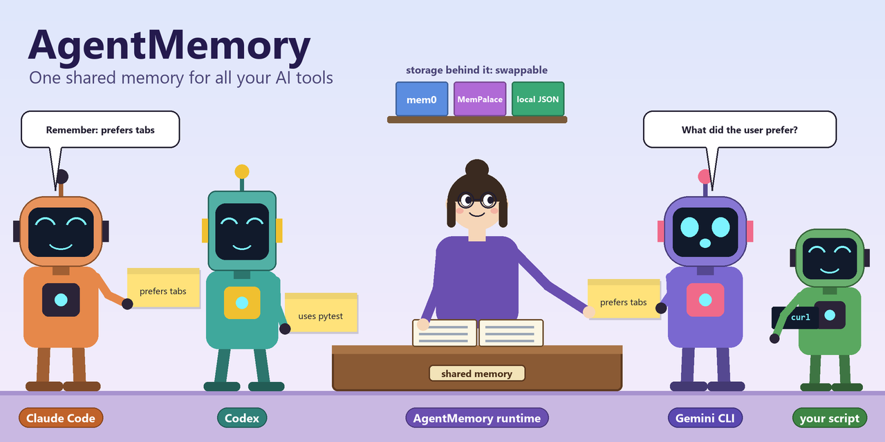
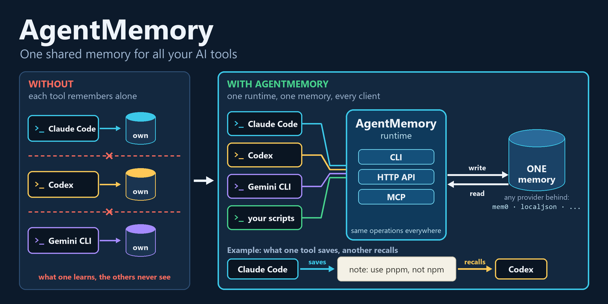
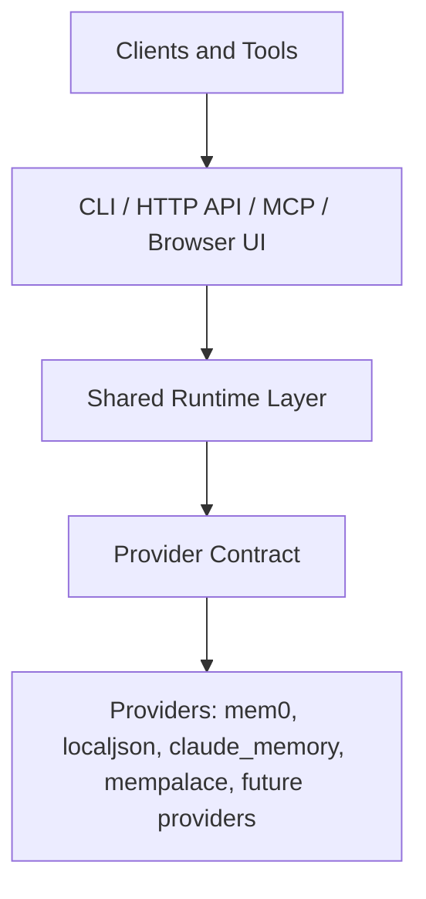

<p align="center"></p>
<h1 align="center">AgentMemory</h1>
<p align="center"><b>Одна общая локальная память для ваших ИИ-инструментов и скриптов — CLI, HTTP API и MCP поверх сменного бэкенда памяти, например mem0.</b></p>
<p align="center">
  <a href="LICENSE"></a>
  <a href="pyproject.toml"></a>
  <a href="#текущий-статус"></a>
  <a href="pyproject.toml"></a>
  <a href="#текущий-статус"></a>
  <a href="https://github.com/AndrewMoryakov/AgentMemory/actions/workflows/ci.yml"></a>
</p>
<p align="center"><a href="README.md">English</a> | <b>Русский</b></p>

```powershell
agentmemory configure --provider localjson   # API-ключи не нужны
agentmemory start-api                        # один локальный рантайм, несколько клиентских интерфейсов
```

AgentMemory — это общий локальный рантайм памяти для ИИ-клиентов и агентов. Он стоит над бэкендом памяти вроде `mem0` и даёт одну стабильную поверхность через CLI, HTTP API и MCP: то, что сохранил один инструмент, может вспомнить другой. Сейчас это **публичная альфа**; прежде чем на него опираться, прочитайте [Текущий статус](#текущий-статус) и [Текущие ограничения](#текущие-ограничения).

## Зачем нужен AgentMemory?

Большинство систем памяти решают задачу бэкенда: хранить, извлекать и ранжировать воспоминания. AgentMemory решает другую задачу: сделать один бэкенд памяти пригодным как единый локальный рантайм для нескольких клиентских интерфейсов.

- **Если** несколько ИИ-инструментов, скриптов и агентских клиентов должны делить одну память, **то** AgentMemory даёт им одни и те же операции через CLI, локальный HTTP API и MCP.
- **Если** у вашего бэкенда памяти есть локальные ограничения на процессы или блокировки, **то** один процесс-владелец держит бэкенд, а всё остальное ходит через него.
- **Если** нужен стабильный контракт поверх особенностей конкретных бэкендов, **то** провайдеры стоят за единым контрактом провайдера с нормализованными записями и типизированными ошибками.
- **Если** хочется ещё и посмотреть, что именно запомнено, **то** локальный API отдаёт браузерный интерфейс для просмотра и редактирования, а команды `doctor` объясняют, что не так.

Разница в одной строке: `mem0` — это движок памяти; `AgentMemory` — слой рантайма памяти, и он *не* решает, что нужно помнить временно, а что постоянно.

**Для кого это не подходит.** Скорее всего, AgentMemory вам не нужен, если память принадлежит одному Python-приложению, прямая интеграция с провайдером уже чистая, вам не нужен доступ по MCP или HTTP и не нужно, чтобы несколько инструментов делили один рантайм. В этом случае прямая интеграция с `mem0` обычно проще.

Подробнее (документы на английском):

- [Why AgentMemory Exists](docs/WHY_AGENTMEMORY.md)
- [Mem0 vs AgentMemory](docs/MEM0_VS_AGENTMEMORY.md)
- [What AgentMemory Adds To Mem0](docs/MEM0_WITH_AGENTMEMORY_VALUE.md)
- [What AgentMemory Actually Adds](docs/WHAT_AGENTMEMORY_ACTUALLY_ADDS.md)
- [Start Here](docs/START_HERE.md)

Более конкретные сценарии: [Use Cases](docs/USE_CASES.md), [Shared Runtime Demo](examples/shared-runtime-demo.md), [MCP Demo](examples/mcp-demo.md).

## Возможности

- **Один рантайм, три интерфейса** — CLI, локальный HTTP API и MCP работают через одни и те же общие операции.
- **Сменные провайдеры** — `mem0` (основной семантический путь), `localjson` (встроенный провайдер для тестов и демо), `claude_memory` (консервативный файловый адаптер для поверхностей памяти Claude Code) и `mempalace` (экспериментальный локальный семантический провайдер).
- **Подключение клиентов** — `connect-clients` автоматически подключает AgentMemory к найденным ИИ-клиентам и редакторам; `status-clients` и `doctor-clients` проверяют результат. Сначала Windows.
- **Браузерный интерфейс** — обзор рантайма, обозреватель воспоминаний, редактирование, закрепление и удаление, статус клиентов.
- **Удалённые MCP-коннекторы** — MCP поверх HTTP на `POST /mcp` с OAuth 2.1 и Dynamic Client Registration — для хостируемых клиентов вроде пользовательских коннекторов Claude.ai и ChatGPT.
- **Встроенная диагностика** — `doctor` проверяет venv, конфигурацию, наличие ключей и состояние; осведомлённые о возможностях подсказки — часть продукта.
- **Опциональная семантика жизненного цикла** — TTL-истечение, если вызывающая сторона решит им пользоваться.
- **Сертификация провайдеров** — провайдеры проверяются по единому общему контракту (`provider-certify`).

## Как это работает

<p align="center">
  
</p>

1. **Выберите провайдера.** `agentmemory configure --provider localjson` (или `mem0`) выбирает бэкенд памяти за рантаймом.
2. **Запустите один локальный рантайм.** `agentmemory start-api` поднимает общий рантайм; он может владеть процессом бэкенда, так что остальные клиенты ходят через него, а не борются за локальные блокировки.
3. **Подключите клиентов.** CLI, скрипты по HTTP и MCP-клиенты (через `connect-clients` или [сниппеты](#основные-команды)) обращаются к одному и тому же рантайму.
4. **Одни и те же операции везде.** Клиенты говорят с общим контрактом, а не с API конкретного бэкенда, поэтому записи одного инструмента видны другим.

<a id="quickstart"></a>
## Быстрый старт

### Самый безопасный путь для первой проверки

Сначала используйте встроенный провайдер `localjson`.

```powershell
git clone https://github.com/AndrewMoryakov/AgentMemory.git
cd AgentMemory
py -3.13 -m venv .venv
.\.venv\Scripts\python.exe -m pip install --upgrade pip
.\.venv\Scripts\python.exe -m pip install -e .
.\.venv\Scripts\agentmemory.exe configure --provider localjson
.\.venv\Scripts\agentmemory.exe doctor
.\.venv\Scripts\agentmemory.exe start-api
.\.venv\Scripts\python.exe .\examples\http_python_roundtrip.py
.\.venv\Scripts\python.exe -m agentmemory.ops_cli list --user-id examples-http-roundtrip --limit 5
```

Этот путь доказывает, что:

- пакет устанавливается
- локальный рантайм стартует
- HTTP API работает
- один клиентский интерфейс сразу может читать и писать память

Как выглядит успех:

- `doctor` не сообщает блокирующих ошибок
- `start-api` печатает URL локального API
- `http_python_roundtrip.py` печатает созданное воспоминание, а также результаты list и search
- последняя команда `list` показывает хотя бы одно воспоминание для `examples-http-roundtrip`

Когда закончите:

```powershell
.\.venv\Scripts\agentmemory.exe stop-api
```

### macOS / Linux

```sh
git clone https://github.com/AndrewMoryakov/AgentMemory.git
cd AgentMemory
python3 -m venv .venv
./.venv/bin/python -m pip install --upgrade pip
./.venv/bin/python -m pip install -e .
./.venv/bin/agentmemory configure --provider localjson
./.venv/bin/agentmemory doctor
./.venv/bin/agentmemory start-api
./.venv/bin/python ./examples/http_python_roundtrip.py
./.venv/bin/python -m agentmemory.ops_cli list --user-id examples-http-roundtrip --limit 5
```

Как выглядит успех:

- `doctor` не сообщает блокирующих ошибок
- `start-api` печатает URL локального API
- скрипт roundtrip печатает созданное воспоминание, а также результаты list и search
- последняя команда `list` показывает хотя бы одно воспоминание для `examples-http-roundtrip`

Когда закончите:

```sh
./.venv/bin/agentmemory stop-api
```

### Основной семантический бэкенд

Переключайтесь на `mem0` только после того, как путь с `localjson` выше сработал. Если нужен основной семантический путь, переключитесь на `mem0`:

```powershell
.\.venv\Scripts\agentmemory.exe configure --provider mem0 --openrouter-api-key "your-openrouter-key"
.\.venv\Scripts\agentmemory.exe doctor
.\.venv\Scripts\agentmemory.exe start-api
```

Как выглядит успех:

- `doctor` подтверждает, что настроенный рантайм пригоден к работе
- `start-api` чисто стартует с настроенным провайдером
- можно снова запустить `.\.venv\Scripts\python.exe .\examples\http_python_roundtrip.py`

### Демо общего рантайма

Канонический сценарий знакомства:

- записать воспоминание через локальный HTTP API
- прочитать то же воспоминание через CLI
- убедиться, что оба клиентских интерфейса обслуживает один общий рантайм

См. [Shared Runtime Demo](examples/shared-runtime-demo.md).

### Локальные файлы рантайма

AgentMemory создаёт локальное состояние рантайма при настройке и использовании. Эти файлы только локальные, их не нужно коммитить:

- `.env`
- `agentmemory.config.json`
- `data/`

В репозитории лежат только безопасные шаблоны вроде `.env.example`.

### Быстрое устранение неполадок

Если быстрый старт не заработал сразу, проверьте сначала следующее:

- Если `agentmemory` не находится, используйте явные пути к командам в `.venv`, как показано выше, а не полагайтесь на активацию оболочки.
- Если API не стартует, повторите `.\.venv\Scripts\agentmemory.exe doctor` и сначала прочитайте блокирующие ошибки.
- Если порт API занят, `start-api` должен выбрать свободный; повторяйте скрипт roundtrip только после того, как напечатан URL API.
- Если путь с `mem0` не работает, вернитесь к `localjson`. Первый путь проверки не должен зависеть от внешних API-ключей и настройки семантического провайдера.

## Снимок архитектуры



Текущие слои рантайма:

- контракт провайдера: нормализованные записи, типизированные ошибки провайдера, возможности (capabilities), политика рантайма
- общий рантайм: реестр операций, адаптеры, валидация, формирование ошибок, маршрутизация через прокси/напрямую
- интерфейсы: CLI, HTTP API, MCP, интерактивная оболочка, браузерный интерфейс
- опциональная семантика рантайма: пагинация, переносимость данных, инвентаризация областей (scope) и управляемая пользователем поддержка жизненного цикла

Подробнее:

- [Architecture](docs/ARCHITECTURE.md)
- [Provider Adapter Rules](docs/PROVIDER_ADAPTER_RULES.md)
- [Future Memory Providers](docs/future-memory-providers/README.md)

## Текущий статус

- `public alpha` (публичная альфа)
- локальный продукт (local-first)
- ядро рантайма работает на Windows, Linux и ожидаемо на macOS
- процесс интеграции с клиентами сначала ориентирован на Windows
- `mem0` — основной семантический провайдер
- `localjson` — встроенный провайдер для тестов и демо
- `claude_memory` — консервативный файловый адаптер для поверхностей памяти Claude Code
- `mempalace` — экспериментальный локальный семантический провайдер на базе коллекции MemPalace, принадлежащей AgentMemory
- контракт провайдера, реестр операций, транспортные адаптеры и политика рантайма реализованы
- диагностика и обнаружение областей (scope) входят в текущую поверхность продукта

## Текущие ограничения

AgentMemory пригоден как локальный рантайм общей памяти, но это всё ещё публичная альфа. Актуальный индекс рисков и багов находится в [Backlog — Known Bugs & Hygiene Items](docs/planning/BACKLOG.md).

Важные текущие ограничения:

- TTL существует как опциональная поддержка истечения. Это метаданные, управляемые вызывающей стороной, а не автоматическая классификация на краткосрочную и долгосрочную память. Провайдерам с нарушенной синхронизацией реестра областей может потребоваться `rebuild-scope-registry`, прежде чем TTL-очистку можно считать полной.
- `mem0` использует безопасный откат к одной странице для пагинации, пока не реализована безопасная для бэкенда стратегия курсоров.
- Дрейф внешней сети в Compose v2 смягчается скриптом `deploy/redeploy.sh`, но первопричина остаётся вне этого репозитория.

## Ключевое проектное решение для Mem0

`mem0` в этом проекте использует локальное встроенное хранилище, а у локальных встроенных бэкендов бывают ограничения на процессы и блокировки.

AgentMemory решает это, давая провайдеру явную транспортную политику рантайма:

- процесс локального API может владеть рантаймом бэкенда
- остальные клиенты могут ходить через этот рантайм
- общим слоям не нужны ветвления под конкретный бэкенд для транспортного поведения

Это один из самых наглядных примеров того, зачем нужен слой рантайма памяти, даже когда бэкенд по-прежнему `mem0`.

## Основные команды

```powershell
.\.venv\Scripts\agentmemory.exe --help
.\.venv\Scripts\agentmemory.exe doctor
.\.venv\Scripts\agentmemory.exe configure --provider localjson
.\.venv\Scripts\agentmemory.exe configure --provider mem0 --openrouter-api-key "your-openrouter-key"
.\.venv\Scripts\agentmemory.exe start-api
.\.venv\Scripts\agentmemory.exe stop-api
.\.venv\Scripts\agentmemory.exe mcp-smoke
.\.venv\Scripts\agentmemory.exe connect-clients
.\.venv\Scripts\agentmemory.exe status-clients --compact
.\.venv\Scripts\agentmemory.exe doctor-clients --compact
```

`agentmemory snippets` печатает готовые сниппеты для Claude Code и Gemini CLI.

## Точки входа в корне репозитория

Для тех, кому нужен один очевидный запуск из корня репозитория, AgentMemory также поставляет тонкие обёртки для Windows и POSIX-оболочек.

Windows:

```powershell
.\agentmemory.ps1 doctor
.\start-agentmemory-api.ps1
.\stop-agentmemory-api.ps1
.\agentmemory-mcp.ps1
```

macOS / Linux:

```sh
./agentmemory.sh doctor
./start-agentmemory-api.sh
./stop-agentmemory-api.sh
./agentmemory-mcp.sh
```

Эти обёртки делегируют работу поддерживаемым скриптам в `scripts/`, так что корень остаётся удобным, а операционная реализация не уезжает из `scripts/`.

## Удалённые MCP-коннекторы (Claude.ai, ChatGPT)

Когда AgentMemory опубликован по публичному URL, он говорит по MCP поверх HTTP на `POST /mcp` и поддерживает OAuth 2.1 с Dynamic Client Registration (RFC 7591). Хостируемые MCP-клиенты вроде Custom Connectors в Claude.ai или ChatGPT находят сервер и регистрируются сами, без выданного оператором client_id.

Настройка в Claude.ai:

1. Settings → Connectors → **Add custom connector**.
2. **Remote MCP server URL**: `https://your-host/mcp`.
3. Сохраните. Claude.ai запрашивает `/.well-known/oauth-authorization-server`, делает POST на `/register`, чтобы получить собственные учётные данные клиента, открывает страницу авторизации и сохраняет полученный токен доступа.

Поля в разделе «Advanced» заполнять не нужно. Записи клиентов хранятся в `{runtime_dir}/oauth_clients.json`, выданные токены — в `{runtime_dir}/oauth_tokens.json`; оба файла переживают перезапуск контейнера.

Серверные настройки:

- `AGENTMEMORY_API_TOKEN` — заранее выданный bearer-токен, принимается наряду с OAuth.
- `AGENTMEMORY_OAUTH_CLIENT_ID` / `_SECRET` — необязательный статический клиент. Не нужен, пока включён DCR (по умолчанию).
- `AGENTMEMORY_OAUTH_DISABLE_DCR=1` — отключить `/register` (тогда клиенты должны быть выданы заранее).
- `AGENTMEMORY_REGISTER_RATE_LIMIT_PER_HOUR` — лимит на IP для /register (по умолчанию 20).
- `AGENTMEMORY_PUBLIC_URL` — канонический https-URL, который сервер должен сообщать в OAuth discovery.

## Браузерный интерфейс

Локальный API также отдаёт браузерный интерфейс по адресу:

```text
http://127.0.0.1:8765/
```

Текущие возможности браузерного интерфейса:

- обзор рантайма
- обозреватель воспоминаний
- просмотр деталей воспоминания
- редактирование текста и метаданных воспоминания
- закрепление важных воспоминаний
- удаление малоценных воспоминаний
- сводка по статусу клиентов

## Провайдеры

### Mem0

Используйте `mem0`, когда нужны:

- семантический поиск
- извлечение и эмбеддинги через OpenRouter
- основной продакшен-путь этого репозитория

Примечания:

- требуется `OPENROUTER_API_KEY`
- в этом репозитории использует транспорт через прокси процесса-владельца
- является текущим провайдером по умолчанию

### Local JSON

Используйте `localjson`, когда нужны:

- ноль внешних API-зависимостей
- простой встроенный бэкенд для тестов и демо
- провайдер, который можно просмотреть на диске

## Карта документации

- [Start Here](docs/START_HERE.md)
- [Why AgentMemory Exists](docs/WHY_AGENTMEMORY.md)
- [Mem0 vs AgentMemory](docs/MEM0_VS_AGENTMEMORY.md)
- [What AgentMemory Adds To Mem0](docs/MEM0_WITH_AGENTMEMORY_VALUE.md)
- [What AgentMemory Actually Adds](docs/WHAT_AGENTMEMORY_ACTUALLY_ADDS.md)
- [Use Cases](docs/USE_CASES.md)
- [Architecture](docs/ARCHITECTURE.md)
- [Runtime Boundaries](docs/RUNTIME_BOUNDARIES.md)
- [Backlog / Current Limitations](docs/planning/BACKLOG.md)
- [Positioning Assets](docs/POSITIONING.md)
- [Roadmap](docs/planning/ROADMAP.md)
- [Contributing](CONTRIBUTING.md)
- [Security](SECURITY.md)
- [Support](SUPPORT.md)

## Примеры

- [HTTP Python Roundtrip](examples/http_python_roundtrip.py)
- [Shared Runtime Demo](examples/shared-runtime-demo.md)
- [MCP Demo](examples/mcp-demo.md)

## Проверка

Полезные локальные проверки:

```powershell
.\.venv\Scripts\python.exe -m unittest discover -s tests -v
.\.venv\Scripts\python.exe -m compileall agentmemory tests scripts/mcp-smoke-test.py
.\.venv\Scripts\agentmemory.exe mcp-smoke
.\.venv\Scripts\python.exe -m agentmemory.ops_cli list-scopes --limit 20
```

## Сертификация провайдеров

AgentMemory рассматривает провайдеры как адаптерные слои за одним общим контрактом.

Полезные ссылки:

- [PROVIDER_CERTIFICATION.md](docs/PROVIDER_CERTIFICATION.md)
- [tests/provider_contract_harness.py](tests/provider_contract_harness.py)

Быстрые вспомогательные команды:

```powershell
.\.venv\Scripts\provider-certify.exe --list
.\.venv\Scripts\provider-certify.exe --list --json
.\.venv\Scripts\provider-certify.exe localjson
.\.venv\Scripts\provider-certify.exe localjson --json --run-tests --summary-only
```

## Лицензия

[MIT](LICENSE).
