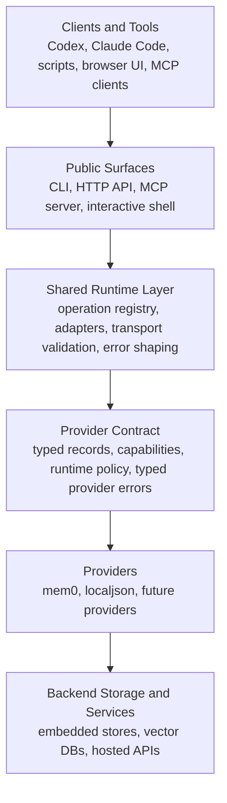

# Architecture

AgentMemory is a local shared-memory runtime built in layers.

## One View

## Core Model

AgentMemory separates concerns this way:

- public surfaces define how tools talk to memory
- shared runtime layers normalize execution and transport behavior
- provider contract defines what backends must implement
- providers contain backend-specific behavior and quirks

This is what keeps the CLI, MCP, and HTTP API aligned.

## Current Runtime Layers

### Public Surfaces

- CLI
- local HTTP API
- stdio MCP server
- interactive shell
- browser UI served by the local API

### Shared Runtime Layer

- operation registry
- transport adapters for CLI, HTTP, and MCP inputs
- validation before provider execution
- shared typed error shaping
- proxy/direct routing

### Provider Contract

Key concepts:

- normalized `MemoryRecord`
- normalized `DeleteResult`
- declared provider capabilities
- declared provider runtime policy
- typed provider errors

### Providers

Current providers:

- `mem0`
- `localjson`

Providers are adapter layers, not thin SDK wrappers.

## Important Design Choice

Runtime transport behavior is part of provider-owned policy.

That means:

- the shared runtime does not need `if provider == "mem0"` branching for transport decisions
- providers declare whether they are `direct`, `owner_process_proxy`, or `remote_only`
- shared layers stay backend-agnostic

## Why This Shape Matters

This architecture makes AgentMemory useful as:

- a local runtime for multiple clients
- a contract surface for MCP and HTTP tooling
- an operational layer around backend memory engines
- a future extension point for additional providers
