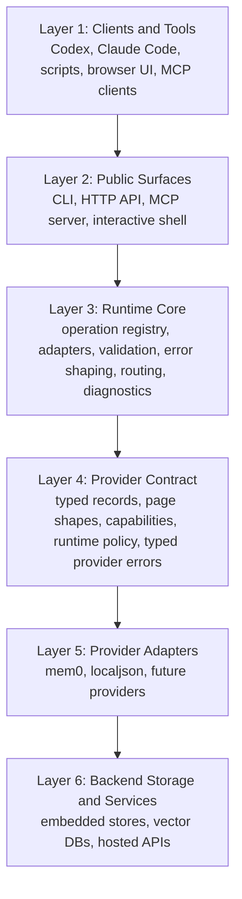

# Architecture

AgentMemory is a runtime, not a memory-policy product.

Its job is to provide one stable operational layer above memory providers so
multiple clients can use the same backend consistently through CLI, HTTP API,
and MCP.

## Layered Model

## Layer Responsibilities

### Layer 1. Clients and Tools

These are consumers of the runtime:

- CLI users
- MCP-compatible agent clients
- local scripts
- browser/admin tooling
- other local applications

They should not need provider-specific SDK knowledge.

### Layer 2. Public Surfaces

These expose the runtime through concrete transports:

- CLI
- local HTTP API
- stdio MCP server
- interactive shell
- browser UI served by the local API

This layer is about access shape, not provider semantics.

### Layer 3. Runtime Core

This is the center of the project.

It owns:

- operation registry
- transport adapters
- shared validation
- shared typed error shaping
- provider-aware routing based on runtime policy
- diagnostics, doctor, runtime status, portability helpers
- shared semantics that are already part of the runtime contract

This layer keeps CLI, HTTP, and MCP behavior aligned.

### Layer 4. Provider Contract

This is the stable boundary between the runtime and adapters.

It defines:

- normalized `MemoryRecord`
- normalized `DeleteResult`
- page shapes
- declared provider capabilities
- declared provider runtime policy
- typed provider errors

Shared layers should depend on this contract, not on backend-specific behavior.

### Layer 5. Provider Adapters

Providers absorb backend-specific complexity and expose the shared contract.

Current providers:

- `mem0`
- `localjson`

Provider responsibilities include:

- backend-specific request/response normalization
- backend-specific error mapping
- accurate capability declarations
- runtime policy declarations
- adapter-owned migration/rebuild logic when needed

Providers are adapter layers, not thin SDK wrappers.

### Layer 6. Backend Storage and Services

This is where provider-native behavior lives:

- embedded databases
- vector stores
- hosted APIs
- backend-native ranking and retrieval behavior
- backend-native locking and process constraints

Those details should terminate at the provider boundary.

## Optional Runtime Semantics

Some features belong in the runtime only as optional semantics, not as product
claims about "how memory should think."

Examples:

- pagination
- provider-neutral export/import
- scope inventory
- dedup as opt-in behavior
- TTL / expiry as opt-in lifecycle metadata

These are valid runtime responsibilities because the runtime is executing a
declared contract consistently across transports and providers.

## What The Runtime Does Not Own

AgentMemory does not own high-level memory policy.

That means it should not decide:

- what is worth remembering
- what should be temporary vs durable
- how long a memory should live by meaning alone
- which domain-specific memory categories a user should use
- what the "correct" retention policy is for every workflow

Those decisions belong to the caller, application, orchestration layer, or user.

## TTL In The Correct Architectural Place

TTL is supported as an optional lifecycle capability.

That means:

- callers may pass `metadata.ttl_seconds` or `metadata.expires_at`
- the runtime normalizes and enforces that metadata consistently
- the runtime does not infer TTL automatically
- the runtime does not classify short-term vs long-term memory for the user

This keeps lifecycle support inside the runtime without turning AgentMemory into
a semantic memory-policy engine.

## Design Consequences

This layered shape is what allows AgentMemory to be:

- one shared local runtime for many clients
- one stable contract above changing providers
- one operational layer around fragile backend constraints
- one future extension point for additional providers

It also gives a hard boundary against product creep:

- runtime responsibilities stay in the runtime
- policy responsibilities stay outside the runtime
